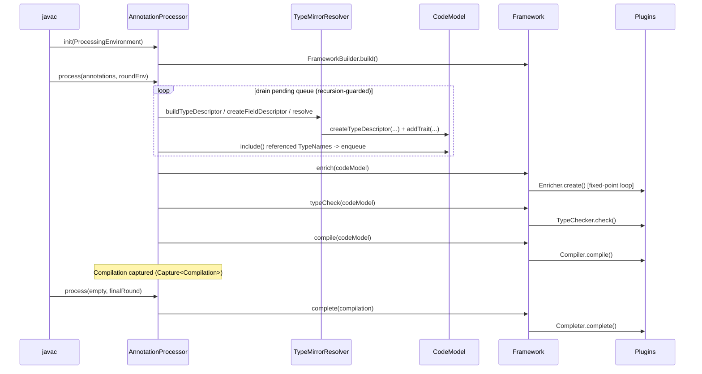
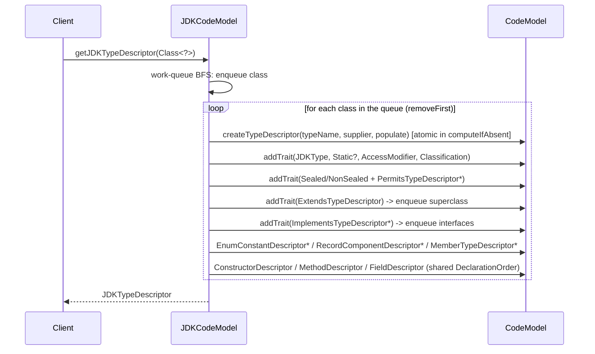

# Codebase Map — `codemodel.build`

> Auto-generated by Cartographer. Last mapped: 2026-08-28

## System Overview

`codemodel.build` is a **language-agnostic, paradigm-neutral Java code model framework** built by Workday, Inc. It provides a structured, serializable representation of software systems that can be inspected, enriched, validated, and compiled through a plugin pipeline. A `CodeModel` can be populated from three independent sources — compiled classes (via `java.lang.reflect`), `.java` source files (via an embedded `javac`), or a live annotation-processing round environment — and all three paths converge on the same `TypeDescriptor` / `TypeUsage` / `Trait` model. Downstream consumers use it to build annotation processors, code generators, and static-analysis tools.

**Stack:** Java 25, Jakarta Inject (`jakarta.inject-api` 2.0.1), Maven multi-module (`${revision}` versioning, currently `0.27.1-SNAPSHOT`), custom marshalling framework (`build.base:base-marshalling`), operator-precedence parser via `build.base:base-parsing`, custom JSR-330 DI implementation. Depends on `build.base` ("base.build") **0.30.1** as managed dependencies only — there is no external parent POM; `codemodel-project` is its own root aggregator.

```mermaid
graph TB
    subgraph Foundation
        F[codemodel-foundation]
    end
    subgraph "Domain Models"
        EXPR[codemodel-expression]
        HIER[codemodel-hierarchical]
        IMP[codemodel-imperative]
        OO[codemodel-objectoriented]
    end
    subgraph "JDK Integration"
        JDK[codemodel-jdk]
        POP[codemodel-jdk-populator]
        DISC[codemodel-jdk-annotation-discovery]
        PROC[codemodel-jdk-annotation-processor]
    end
    subgraph "Pipeline Framework"
        FW[codemodel-framework]
        FWB[codemodel-framework-builder]
    end
    subgraph DI
        DI[codemodel-dependency-injection]
    end

    F --> EXPR
    F --> HIER
    EXPR --> IMP
    HIER --> OO
    EXPR --> OO
    OO --> JDK
    IMP --> JDK
    JDK --> POP
    JDK --> DI
    OO --> DI
    F --> FW
    FW --> FWB
    JDK --> FWB
    DI --> FWB
    POP --> PROC
    FWB --> PROC
    DISC --> PROC
    HIER --> JDK
```

### What changed since the 2026-07-02 map

- **Module rename (#124):** every module took a `codemodel-` prefix (`jdk-codemodel` → `codemodel-jdk`, `expression-codemodel` → `codemodel-expression`, `dependency-injection` → `codemodel-dependency-injection`, etc.). Maven `artifactId`s and directory names changed; **most** Java package names did **not** — the exception is DI, whose package moved `build.codemodel.injection` → `build.codemodel.dependency.injection`.
- **New module `codemodel-jdk-populator` (#125):** the entire javac source-parsing pipeline (`JdkInitializer`, `TypeMirrorResolver`, `JdkExpressionConverter`, `JdkStatementConverter`, `SourceLocation`) was extracted out of `codemodel-jdk` into its own module. `codemodel-jdk` no longer has any `javax.tools` / `com.sun.*` dependency. `SourceLocation` now lives at `build.codemodel.jdk.populator.descriptor.SourceLocation`.
- `codemodel-jdk`'s reflection path gained enum constants, record components, nested types, sealed/permits, and remaining modifier traits (#150, #152). `TypeUsages.isAssignable` — a JLS-correct wildcard/generic subtyping engine (originally added as `isCompatible` in #165, later restructured into `isAssignable`/`contains`) — is consumed by DI (#166).
- DI gained `TypeLiteral` binding (#149), wildcard-bearing dependency resolution (#166), qualified `@Provides` resolution (#162–#164).
- `objectoriented` split `MethodDescriptor.signature()` into a display `signature()` and an `overrideKey()` (#134) and added the `DeclarationOrder` trait (#133).
- `foundation` made trait singularity explicit with `@Singular`/`@NonSingular` (#141), made `AnnotationValue.Value` variants real marshalled records (#116, losslessly round-tripping `ClassRef`/`EnumConstant`), and strips the synthetic `java.lang` prefix from primitive `canonicalName()` (#142).

---

## Directory Structure

```
codemodel.build/
├── codemodel-foundation/               # Core: CodeModel registry, TypeDescriptor, TypeUsage hierarchy,
│                                       #   Trait/Traitable system, naming, marshalling, transport transformers
├── codemodel-expression/               # Expression AST nodes + operator-precedence parser hooks (base-parsing)
├── codemodel-hierarchical/             # Type hierarchy: parents/children/ancestors/descendants/assignability
├── codemodel-imperative/               # Statement AST nodes: Block, If, While, Return, Assignment
├── codemodel-objectoriented/           # OOP traits: classes/interfaces, fields, methods, constructors, modifiers
├── codemodel-jdk/                      # Reflection-based JDKCodeModel + shared descriptor/expression/statement
│                                       #   vocabulary + referencesTo() + JDKModuleDescriptor + TypeUsages
├── codemodel-jdk-populator/            # NEW: javac source-parsing pipeline (JdkInitializer, TypeMirrorResolver,
│                                       #   expression/statement converters, rescan, SourceLocation)
├── codemodel-dependency-injection/     # Custom JSR-330 DI container built on JDKCodeModel introspection
├── codemodel-framework/                # Pure-interface pipeline contracts: Initializer/Enricher/TypeChecker/…
├── codemodel-framework-builder/        # Concrete FrameworkBuilder + InternalFramework pipeline engine
├── codemodel-jdk-annotation-discovery/ # AnnotationDiscovery SPI + @Discoverable
├── codemodel-jdk-annotation-processor/ # javax.annotation.processing.Processor driving the full pipeline
├── config/checkstyle/                  # Hand-rolled Checkstyle ruleset + suppressions
├── config/pmd/                         # PMD ruleset
├── config/intellij/                    # Shared IntelliJ code style
├── docs/                               # CODEBASE_MAP.md (this file)
└── pom.xml                             # Root aggregator POM (packaging=pom, Java 25, version ${revision})
```

**Maven reactor order (low → high):**
`codemodel-foundation` → `codemodel-expression` → `codemodel-hierarchical` → `codemodel-imperative` → `codemodel-objectoriented` → `codemodel-jdk` → `codemodel-dependency-injection` → `codemodel-framework` → `codemodel-framework-builder` → `codemodel-jdk-annotation-discovery` → `codemodel-jdk-annotation-processor` → `codemodel-jdk-populator`

---

## Module Guide

### `codemodel-foundation`

**Purpose:** The substrate every other `codemodel-*` module builds on. Defines the language-and-paradigm-agnostic in-memory model of *types*: a `CodeModel` registry holding `TypeDescriptor` / `ModuleDescriptor` / `NamespaceDescriptor` nodes, the `TypeUsage` hierarchy (how types are *used*), the `Name` value types, and the generic `Trait` / `Traitable` extension mechanism. Also supplies marshalling destructors/constructors and `base-transport` `Transformer`s. Models are mutable, thread-safe (per-node `ConcurrentHashMap` + atomic `compute`), and may be incomplete or contradictory by design.

**Entry point:** `build.codemodel.foundation.CodeModel` (interface); `ConceptualCodeModel` (default concrete impl); `AbstractCodeModel` (base for specialized models).

**Packages:**

| Package | Contents |
|---|---|
| `build.codemodel.foundation` | `CodeModel`, `AbstractCodeModel`, `ConceptualCodeModel`, `CodeModelTraitable` (package-private trait store) |
| `build.codemodel.foundation.descriptor` | `TypeDescriptor`/`AbstractTypeDescriptor`/`PolymorphicTypeDescriptor`, same trio for `ModuleDescriptor` and `NamespaceDescriptor`; trait system `Trait`/`Traitable`/`TraitAware`/`AbstractTraitable`/`@Singular`/`@NonSingular`; descriptor traits `CallableDescriptor`, `FormalParameterDescriptor`, `ThrowableDescriptor` (`@NonSingular`), `RequiresModuleDescriptor` (`@NonSingular`) |
| `build.codemodel.foundation.naming` | `Name`, `IrreducibleName`, `Namespace`, `ModuleName`, `TypeName`, `CallableName`, `NameProvider`, `NonCachingNameProvider`, `CachingNameProvider` |
| `build.codemodel.foundation.usage` | `TypeUsage` + full hierarchy, `AnnotationValue` (sealed `Value`), `ExplicitAnnotationParens` |
| `build.codemodel.foundation.usage.pattern` | Monadic matchers: `TypeUsagePattern`/`TypeUsageMatch` base + `Named*`, `Generic*`, `Annotation*`, `Annotated*`, `Optional*` pattern/match pairs |
| `build.codemodel.foundation.transport` | `base-transport` `Transformer`s: `TypeNameTransformer`, `IrreducibleNameTransformer`, `ModuleNameTransformer`, `NamespaceTransformer` |

`module-info.java` is an `open module` and exports all six packages.

**Key files:**

| Class | Purpose |
|---|---|
| `CodeModel` | Registry interface (`extends Traitable, Queryable`): create/get `TypeDescriptor`/`ModuleDescriptor`/`NamespaceDescriptor` by name, stream them, `createTraitable`, `getNameProvider`, `getEmptyModuleTypeName` (#117). |
| `AbstractCodeModel` | Abstract impl. Three `ConcurrentHashMap` registries keyed by `TypeName`/`ModuleName`/`Namespace`; delegates trait ops to an internal `CodeModelTraitable`; owns a `HeapBasedCompositeIndex` for `Queryable.match()`. `createX(name, supplier, populate)` methods use `computeIfAbsent` and run `populate` + `index.index(...)` **atomically inside the mapping function** — no thread observes a half-built descriptor, and `populate` is **skipped entirely if the node already exists**. `removeTypeDescriptor`/`removeModuleDescriptor` unindex. `iterator(Class)` defines mereology `parts()` and does **not** include the model itself unless `traverse().reflexive(true)`. |
| `ConceptualCodeModel` | Default concrete `CodeModel`; marshalling-registered. |
| `CodeModelTraitable` | Package-private per-object trait store. Two maps: `singularTraitsByClass` (`Class → Trait`) and `traitsByClass` (`Class → Set<Trait>`). Static JVM-global caches: `singularTraitClasses`, `nonSingularTraitClasses`, `registrationTraitClassByTraitClass`. Implements the atomic add/remove/computeIfAbsent/computeIfPresent, `TraitAware` lifecycle callbacks, and (un)indexing. |
| `Trait` / `Traitable` / `TraitAware` | `Trait` is an empty marker. `Traitable extends Composite`: `addTrait`/`createTrait(Function)`, `removeTrait`, `computeIfAbsent`/`computeIfPresent` (atomic), `traits()`/`traits(Class)`/`traits(Class...)`, `getTrait`/`trait`. `TraitAware` adds `onAddedTrait`/`onRemovedTrait` default-no-op callbacks. |
| `@Singular` / `@NonSingular` | `RUNTIME` markers on a `Trait` class (or a supertype). `@Singular` → 0..1 per registration class (a second add throws `IllegalArgumentException`); `@NonSingular` → 0..* (default). #141 added the explicit annotations and the dedicated singular map. |
| `AbstractTraitable` | Base for every model node. Lazily creates its backing `Traitable` via `codeModel().createTraitable(this)` on first trait use (double-checked `synchronized`). `iterator(Class)` = attached traits ∪ `compositeChildren()`. `compositeChildren()` default `Stream.empty()`, overridden widely for mereology. `equals` compares `lazyTraitable` only. |
| `TypeDescriptor` / `AbstractTypeDescriptor` / `PolymorphicTypeDescriptor` | A named-type definition node carrying a `TypeName`; `equals` on `typeName` + traits. `PolymorphicTypeDescriptor.of(codeModel, typeName)` is the default supplier — all semantics come from traits. |
| `ModuleDescriptor` / `NamespaceDescriptor` (+ `Abstract*`/`Polymorphic*`) | Module keyed by `ModuleName` (`requires()` derived from `RequiresModuleDescriptor` traits); namespace keyed by `Namespace` (`isRoot()`, `parent()` throws `IllegalStateException` if the parent namespace is missing). |
| `CallableDescriptor` | `Trait, Composite, Traitable`: `typeDescriptor()`, `callableName()`, `returnType()`, indexed `FormalParameterDescriptor`s, `throwables()` from `ThrowableDescriptor` traits. |
| `FormalParameterDescriptor` | `AbstractTraitable`; `Optional<IrreducibleName> name()`, `TypeUsage type()`; `of(codeModel,name,type)`. |
| `NameProvider` | Factory/flyweight for all `Name`s. SPI method `getTypeName(moduleName, namespace, enclosingTypeName, irreducibleName)`. Defaults: `getEmptyModuleTypeName(fqn)` (#117); `getTypeName(Class)` — uses `getEnclosingClass()`, synthesizes `_`-prefixed names for anonymous/local classes to avoid collisions (#129); `getTypeNameFromBinary(Optional<ModuleName>, String)` recursively splits on `$`; `getTypeName(String encoded)` splits on `/` then binary name. `CachingNameProvider` wraps another provider and caches `IrreducibleName`/`Namespace`/`ModuleName` **but always delegates `getTypeName` uncached**. |
| `*Transformer` (transport) | `base-transport` `Transformer<Name,String>` pairs; `transform` = `toString()`, `reform` = `nameProvider.getX(string)`. Each constructed with a `NameProvider`. |

**TypeUsage hierarchy:**

```
TypeUsage                       (interface: Composite, Traitable)
└── AbstractTypeUsage           (abstract, extends AbstractTraitable; render() template method)
    ├── AbstractNamedTypeUsage  (abstract, implements NamedTypeUsage; holds TypeName typeName())
    │   ├── SpecificTypeUsage        — raw non-parameterized reference ("String")
    │   ├── VoidTypeUsage            — the void type (java.base/java.lang.void; all instances equal, hashCode 0)
    │   ├── UnknownTypeUsage         — placeholder when a type cannot be resolved (synthetic TypeName "null")
    │   ├── GenericTypeUsage         — parameterized type (List<String>); ArrayList<Lazy<TypeUsage>> parameters;
    │   │                              isOptional() when typeName == Optional and <2 params
    │   ├── AnnotationTypeUsage      — annotation use; ALSO implements Trait (@NonSingular) + Comparable
    │   └── TypeVariableUsage        — named type variable T with Optional<Lazy<TypeUsage>> lower/upper bounds
    │       └── WildcardTypeUsage    — the "?" wildcard (synthetic TypeName "wildcard"); EXTENDS TypeVariableUsage
    ├── ArrayTypeUsage              — wraps a Lazy<TypeUsage> component; render = component[]
    ├── UnionTypeUsage              — ArrayList<Lazy<TypeUsage>> joined by " | "
    └── IntersectionTypeUsage       — ArrayList<Lazy<TypeUsage>> joined by " & "

NamedTypeUsage (interface) — extends TypeUsage; implemented by AbstractNamedTypeUsage
```

**`render(nameRenderer, usageRenderer)` template method:** `AbstractTypeUsage` implements a single `render` abstract method per subclass, invoked two ways:
- `canonicalName()` → `render(TypeName::canonicalName, TypeUsage::canonicalName)` — module-free canonical Java source form: `java.util.List<java.lang.String>`.
- `toString()` → `render(TypeName::toString, TypeUsage::toString)` **then appends attached traits** via `Traitable.toString(this)` (#137) — e.g. `java.base/java.util.List<java.base/java.lang.String> [SourceLocation]`.

**Self-referential generics handling:** `TypeVariableUsage` and `GenericTypeUsage` store bounds/parameters as `Optional<Lazy<TypeUsage>>` / `ArrayList<Lazy<TypeUsage>>` rather than eager references. Three layers protect against `StackOverflowError` on types like `T extends Comparable<T>`:
1. `Lazy` wrapper breaks the eager construction cycle — composites are built holding not-yet-resolved `Lazy` placeholders.
2. `equals()` compares bounds via `canonicalName()` string equality rather than deep structural recursion.
3. `renderBound` short-circuits a nested `TypeVariableUsage` bound by printing only its `typeName()` (not the full `extends` declaration), threaded through every nesting level.

**`TypeName` structure:** carries `Optional<ModuleName> moduleName`, `Optional<Namespace> namespace`, `Optional<TypeName> enclosingTypeName`, `IrreducibleName name`. Two derived forms from the same structure:
- `canonicalName()` — dot-separated source form, recursing through `enclosingTypeName`; **strips the synthetic `java.lang` namespace from primitives** (`isPrimitive()` via `Introspection.primitives()`, #142).
- `binaryName()` / `toString()` — `[module/]` prefix + dot-package + `$`-separated nested types.

**Trait / Traitable system:**
- **Registration class.** `getRegistrationClass(traitClass)` walks the class's own hierarchy (superclasses, then interfaces, via an `ArrayDeque`) for the first type annotated `@Singular` or `@NonSingular`; a type carrying *both* throws `IllegalStateException`. If none is annotated it returns the most immediate concrete non-abstract/non-anonymous/non-synthetic `Trait` class. Cached JVM-globally in `registrationTraitClassByTraitClass`.
- **Atomicity & indexing.** Every mutation (`createTrait`, `removeTrait`, `computeIfAbsent`, `computeIfPresent`) runs inside `ConcurrentHashMap.compute` on the relevant map, then calls `codeModel.index().index(trait)`/`unindex(trait)` and finally `codeModel.index().reindexDynamic(object)` so `@Indexable`/dynamic query fields on the host stay current.
- **Lifecycle.** If the host `instanceof TraitAware`, `onAddedTrait`/`onRemovedTrait` fire inside the same atomic block.

**`AnnotationValue.Value` sealed interface (#116):** `AnnotationValue.value()` returns a typed, exhaustively-switchable sealed interface — `Literal(Object)`, `ClassRef(TypeName)`, `EnumConstant(TypeName, String)`, `Nested(AnnotationTypeUsage)`, `Array(List<Value>)`. As of #116 **each variant is its own `@Marshal`/`@Unmarshal`-registered type**, so `ClassRef`/`EnumConstant` now **round-trip losslessly** (previously they degraded to `Literal` on unmarshal). Only `Literal` still carries a raw `Object` on the wire. `compositeChildren()` descends into nested/array annotations.

**`ExplicitAnnotationParens`:** `@Singular` single-constant enum `Trait` marking `@Foo()` vs `@Foo`; only ever attached by source-based population (#138).

**Naming types:** `IrreducibleName` (leaf), `Namespace` (ordered `IrreducibleName` parts, `level()` = depth + 1 with root = 1), `ModuleName` (dot-list, rejects empty parts), `TypeName` (composite), `CallableName` (module/namespace/typeName + name). All equality is string-based on `toString()`.

**Marshalling convention** (used across every module):
```java
// Deserialize — @Unmarshal constructor
Foo(@Bound CodeModel codeModel, Marshaller marshaller, <fields…>, Stream<Marshalled<Trait>> traits) {
    // nested model refs arrive as Marshalled<X>, rehydrated via marshaller.unmarshal(...)
    // base ctor binds `this` into the Marshaller and replays traits via getDelegate().addTrait(...)
}

// Serialize — @Marshal destructor method
@Marshal void destructor(Marshaller m, Out<X> f1, Out<Stream<Marshalled<Trait>>> traits) {
    f1.set(this.f1);
    // traits filtered by m.isMarshallable(trait.getClass()) — unknown traits silently dropped
}

// Static initializer
static { Marshalling.register(Foo.class, MethodHandles.lookup()); }   // enums: Marshalling.registerEnum(...)
```

**Pattern-matching sub-package** (`usage.pattern`): `TypeUsagePattern<T,M>` / `TypeUsageMatch<T>` monadic matchers with `map`/`flatMap`/`filter`/`orElseThrow`/`stream`/`ifPresent`, plus specializations for `NamedTypeUsage` (by `TypeName` or `Predicate`), `GenericTypeUsage` (zips parameter sub-patterns, arity-checked), `AnnotationTypeUsage`, `AnnotatedTypeUsage` (matches any usage carrying annotation traits satisfying supplied patterns), and `Optional` (`GenericTypeUsagePattern` bound to `java.util.Optional`).

**Mereology / `compositeChildren()` pattern:** All `AbstractTraitable` subclasses override `protected Stream<? extends Composite> compositeChildren()` to expose their structural (non-trait) children. `AbstractTraitable#iterator(Class<T>)` merges the trait iterator with `compositeChildren()`. Used throughout every module — override this, not `iterator()`, when adding structural child fields.

**Dependencies:** `base-foundation`, `base-mereology`, `base-query`, `base-marshalling`, `base-transport`. **This is the leaf** — depends on no other `codemodel-*` module.
**Depended on by:** every other module.

---

### `codemodel-expression`

**Purpose:** An AST / node model for **expressions** — literals, variables, function/method usage, casts, string templates, and all arithmetic / logical / comparison operators — expressed against the types in a `CodeModel`. Every node is a `Traitable` and marshallable. Independent of statements and OO concepts.

**Entry points:** `build.codemodel.expression.Expressions` (a `CodeModel`-bound factory facade), `build.codemodel.expression.Expression` (root interface; `extends Traitable`; single abstract `Optional<TypeUsage> type()`).

**Packages:** `build.codemodel.expression` (~47 files); `.naming` (`AbstractCallableName`, `FunctionName`, `VariableName`); `.parsing` (only `EmptyExpression`, a null-object `Expression`). `module-info` is a plain (non-`open`) module.

**Key files:**

| File | Purpose |
|---|---|
| `Expression` | Root interface; `extends Traitable`; `Optional<TypeUsage> type()` — `empty()` means "not known here", not "uninferable". |
| `AbstractExpression` | `extends AbstractTraitable implements Expression`; default `type()` = `getTrait(ExpressionType.class).map(ExpressionType::typeUsage)`. |
| `ExpressionType` | `@Singular` `Trait` + `Composite` carrying one resolved `TypeUsage`; `ExpressionType.of(typeUsage)`; attached post-construction by type-inference passes. |
| `Expressions` | `CodeModel`-bound factory (368 lines): `valueOf` (dispatches `Boolean`→`BooleanLiteral`, `Number`→`NumericLiteral`, else `Literal.of`), `and`/`or`/`not`, `equalTo`/`notEqualTo`/`lessThan`/…, `add`/`subtract`/`multiply`/`divide`/`modulo`/`negative`, `apply(FunctionName, Expression...)`, `variableOf`, `cast`. **No** helpers for `StringLiteral`, `TemplateExpression`, `Then`/`AnyInCommon`/`NoneInCommon` — use their static `of(...)`. |
| `Literal<T>` | `extends AbstractExpression`; holds `value` + `Optional<TypeUsage>`; overrides `type()` with its own field. **Not** marshalling-registered (commented out); each concrete subclass registers itself. |
| `BooleanLiteral` / `NumericLiteral` / `StringLiteral` | `Literal<Boolean> implements LogicalExpression` / `Literal<Number> implements ArithmeticExpression` / `Literal<String>`. |
| `VariableUsage` | `VariableName` + `Optional<TypeUsage>`. |
| `FunctionUsage` | `FunctionName` + `ArrayList<Expression>` args; `type()` hard-coded `Optional.empty()` ("inferred from the function definition"). |
| `FunctionDescriptor` | `@NonSingular` `Trait` (`AbstractTraitable implements CallableDescriptor`) describing a function on a `TypeDescriptor`. Since #121 its declaring `TypeDescriptor` is `@Bound` (not marshalled) — breaks the descriptor↔trait marshal recursion. |
| `Cast` | `targetType` + inner `Expression`; `type()` = `Optional.of(targetType)`. |
| `TemplateExpression` | `List<Expression>` parts; `type()` always `String`; `of(list)` / `empty(codeModel)`. |
| `naming/FunctionName` | `final extends AbstractCallableName`; `of(Optional<ModuleName>, Optional<Namespace>, Optional<TypeName>, IrreducibleName)` + `of(IrreducibleName)`. |
| `naming/VariableName` | `final implements Name` **directly** (not `AbstractCallableName`, unlike `FunctionName`/`MethodName`). |
| `parsing/EmptyExpression` | `AbstractTraitable implements Expression`; `type()` empty; parse-result placeholder. |

**Expression node hierarchy:**

```
Expression  (interface, type())
├── EmptyExpression                         (parsing; AbstractTraitable)
└── AbstractExpression  (abstract; type() <- ExpressionType trait by default)
    ├── Literal<T>  (overrides type() with own field)
    │   ├── BooleanLiteral   (implements LogicalExpression)
    │   ├── NumericLiteral   (implements ArithmeticExpression)
    │   └── StringLiteral
    ├── VariableUsage
    ├── FunctionUsage                        (type() = empty)
    ├── Cast                                 (type() = targetType)
    ├── TemplateExpression                   (type() = String)
    ├── MethodUsage / ThisUsage / SuperUsage *** defined in codemodel-objectoriented ***
    ├── AbstractArithmeticExpression  (implements ArithmeticExpression; type() from stored Optional<TypeUsage>)
    │   ├── AbstractBinaryArithmeticExpression   (left()/right())
    │   │   ├── Addition, Subtraction, Multiplication, Division, Modulo, Exponent
    │   │   └── (marker: BinaryArithmeticExpression)
    │   └── AbstractUnaryArithmeticExpression    (expression())
    │       └── Negative
    └── AbstractLogicalExpression  (implements LogicalExpression; type() ALWAYS Boolean SpecificTypeUsage)
        ├── AbstractBinaryLogicalExpression      (left()/right())
        │   ├── Conjunction (and), Disjunction (or), ExclusiveDisjunction (xor), Then (then)
        ├── AbstractUnaryLogicalExpression       (expression())
        │   └── Negation (not)
        └── AbstractComparisonExpression         (left()/right())
            ├── EqualTo, NotEqualTo, LessThan, LessThanOrEqualTo, GreaterThan, GreaterThanOrEqualTo
            └── AnyInCommon (set overlap), NoneInCommon (set disjointness)
```

Marker interfaces (`ArithmeticExpression`, `BinaryArithmeticExpression`, `UnaryArithmeticExpression`, `LogicalExpression`, `BinaryLogicalExpression`, `UnaryLogicalExpression`, `ComparisonExpression`) — none `sealed`.

**Type-resolution pattern:** `AbstractExpression#type()` reads the `ExpressionType` trait, decoupling type resolution from construction. But **most concrete nodes override `type()`** and ignore the trait: `Literal` (own field), `Cast` (`targetType`), `TemplateExpression` (always `String`), `AbstractLogicalExpression` (**always Boolean**, stored at construction), `AbstractArithmeticExpression` (stored `Optional<TypeUsage>`, may be empty — no operand-based numeric promotion), `FunctionUsage` (always empty). The trait is meaningful mainly for bare/opaque expressions and for callers who explicitly stamp a resolved type.

**Parsing via `build.base:base-parsing`:** `base-parsing` is **`test`-scope only** and is **not** in `module-info` — the module ships no parser, only `EmptyExpression`. The integration pattern is specified by `src/test/java/build/codemodel/expression/parsing/ExpressionParserTests.java`. `ExpressionParser<Expression>` is a Pratt / precedence-climbing parser configured imperatively via `defineSection("(", ")")`, `defineAtom(regex, factory)`, `defineUnary(token, bindingPower, factory)`, `defineBinary(token, bindingPower, factory)` — all wired to concrete node factories like `Addition::of`. **Binding power is "loose-binds-high"** (higher number = lower precedence): unary `-`/`abs` at 1, `^` and comparisons at 2, `* / %` and `eq`/`ne` at 3, binary `+`/`-` at 4, `min`/`max` at 5, `not` at 11, `and`/`or`/`xor`/`then` at 12–15. `parser.parse("")`/null/whitespace → `null`.

**Gotchas:**
- `Literal` deliberately does not self-register for marshalling; each concrete subclass does. Don't marshal a raw `Literal`.
- Logical/comparison nodes *always* report Boolean; arithmetic nodes report *nothing* unless a `TypeUsage` was explicitly supplied.
- `FunctionUsage.type()` is always `empty()`.
- The parser is not part of the shipped module — a consumer must add `base-parsing` and replicate the registrations.
- `VariableName implements Name` directly, not `AbstractCallableName`.
- `AbstractExpression.type()` via `ExpressionType` is effectively dead code for most concrete nodes (they override).

**Dependencies:** `codemodel-foundation`, `base-foundation`, `base-marshalling`, `base-mereology`.
**Depended on by:** `codemodel-imperative`, `codemodel-objectoriented`, `codemodel-jdk`, `codemodel-jdk-populator`.

---

### `codemodel-hierarchical`

**Purpose:** A parent/child type-hierarchy layer on top of `codemodel-foundation`: a `CodeModel` mixin plus `TypeDescriptor` / `Trait` mixins that let types declare parents and answer hierarchy questions (roots, ancestors, descendants, level/depth, assignability, diamond detection). Generic over "what a parent relationship means" — the OO module supplies `extends`/`implements` as concrete `ParentTypeDescriptor` traits.

**Entry points:** `build.codemodel.hierarchical.HierarchicalCodeModel`, `build.codemodel.hierarchical.descriptor.HierarchicalTypeDescriptor`.

**Packages:** `build.codemodel.hierarchical` (`HierarchicalCodeModel`, `AbstractHierarchicalCodeModel`); `.descriptor` (`HierarchicalTypeDescriptor`, `AbstractHierarchicalTypeDescriptor`, `ParentTypeDescriptor`, `AbstractParentTypeDescriptor`). `module-info` is an **`open module`**; `requires transitive build.codemodel.foundation`.

**Key files:**

| File | Purpose |
|---|---|
| `HierarchicalCodeModel` | `interface extends CodeModel`. Default `roots()` (type descriptors that are `HierarchicalTypeDescriptor` and `isRoot()`); `isAssignable(TypeName, TypeName)` (**throws `IllegalArgumentException`** if either isn't a `HierarchicalTypeDescriptor`); static `isAssignable(HTD, HTD)` and static `getAssignableTypeDescriptors(...)` (intersection of descendants). |
| `AbstractHierarchicalCodeModel` | `abstract extends AbstractCodeModel`. Maintains three `ConcurrentHashMap`s: `orphanedChildren` (`TypeName` → set), `parents` (child→parents), `children` (parent→children). Hooks: `onCreatedTypeDescriptor`, `onCreatedParentTypeDescriptor`, `onOrphanedChildTypeDescriptor`, `onRemovedParentTypeDescriptor`. `prepareForUnmarshalling()` re-inits the maps. |
| `HierarchicalTypeDescriptor` | The hierarchy DSL (all default methods): `hasParents`/`isRoot`, `parentTypeUsages`/`parentTypeNames`/`parents[(Class)]`, `level()`, `ancestors[(Class)]`/`ancestorTypeNames`, `getAncestor(Predicate)`, `formsDiamondPattern([Predicate])`, `isChild(...)`, `children[(Class)]`/`descendants[(Class)]`/`descendantTypeNames`, `isAssignableTo(TypeName|HTD)`. |
| `AbstractHierarchicalTypeDescriptor` | `abstract extends AbstractTypeDescriptor implements HierarchicalTypeDescriptor, TraitAware`. Overrides `onAddedTrait`/`onRemovedTrait` to notify the code model when a `ParentTypeDescriptor` trait changes; overrides `parents()`/`children()` to read the code-model maps when the model is an `AbstractHierarchicalCodeModel` (interface default otherwise). |
| `ParentTypeDescriptor` | `interface extends Trait, Composite, Traitable`: `NamedTypeUsage parentTypeUsage()`, default `parentTypeName()`, default `parent()` (resolves via code model, **throws `IllegalStateException` if missing**). |
| `AbstractParentTypeDescriptor` | `abstract extends AbstractTraitable`; stores `NamedTypeUsage parentTypeUsage`; `compositeChildren()` = the parent type usage; marshalled as `Marshalled<NamedTypeUsage>`. |

**Architecture notes:**
- **Orphaned-children resolution.** Types can be added in any order. When a type declares a parent not yet in the model, `onOrphanedChildTypeDescriptor` stashes the child under the missing parent's `TypeName` in `orphanedChildren`. When that parent is later created, `onCreatedTypeDescriptor` does `orphanedChildren.compute(typeName, …)`, wires every stashed child via `onCreatedParentTypeDescriptor`, and clears the entry. It also scans the new type's own `ParentTypeDescriptor` traits to link upward. Post-creation trait changes go through `AbstractHierarchicalTypeDescriptor.onAddedTrait`/`onRemovedTrait`.
- **`level()` cycle guard.** `level()` = `1 + max(parent.level())`, `0` for a root; delegates to `level(Set<TypeName> visited)` which does `if (!visited.add(typeName())) throw new IllegalStateException("Cycle detected in type hierarchy at: " + typeName());` and removes in a `finally`. `getAncestor(Predicate)` uses the same guard.
- **`isAssignableTo` = DFS up the ancestor chain** — check direct parents against the predicate first, then recurse. `ancestors()`/`descendants()` instead do a BFS worklist over a `LinkedHashSet`.
- **`formsDiamondPattern([exclusionPredicate])`** — only meaningful with ≥2 (filtered) parents; non-empty intersection of each parent's `ancestors()` ⇒ diamond.

**Gotchas:**
- `AbstractHierarchicalTypeDescriptor.parents()`/`children()` behave differently depending on whether the model extends `AbstractHierarchicalCodeModel` (map lookup, includes orphan-resolved links) vs a bare `HierarchicalCodeModel` (recompute from traits). Mixing implementations gives inconsistent results.
- The interface-default `parents()` **throws** if a declared parent isn't in the model; the map-based path silently returns only resolved parents.
- `level()` / `getAncestor()` throw on cycles rather than returning a sentinel.
- `HierarchicalCodeModel.isAssignable(TypeName,TypeName)` throws `IllegalArgumentException` (not `Optional.empty`) for unknown/non-hierarchical types.
- Module is `open` (unlike `codemodel-expression` / `codemodel-imperative`).
- Never-resolved `orphanedChildren` entries persist until the parent appears or the child's trait is removed.

**Dependencies:** `codemodel-foundation` (transitive), `base-foundation`, `base-marshalling`, `base-mereology`.
**Depended on by:** `codemodel-objectoriented`, `codemodel-jdk`, `codemodel-jdk-populator`, `codemodel-jdk-annotation-processor`.

---

### `codemodel-imperative`

**Purpose:** A minimal statement / control-flow model — blocks, assignment, `if`, `while`, `return` — built on `codemodel-expression` (conditions and RHS values are `Expression`s). No `for`, `switch`, or break/continue (those live in `codemodel-jdk`'s richer `statement` package).

**Entry points:** `build.codemodel.imperative.Statement` (marker interface, `extends Traitable`, no methods), `build.codemodel.imperative.Statements` (`CodeModel`-bound factory). `module-info` is a plain module; `requires transitive` foundation + expression.

**Key files:**

| File | Purpose |
|---|---|
| `Statement` | Marker interface `extends Traitable`. Carries no semantics itself — behavior lives in downstream consumers. |
| `Statements` | Factory: `assign(VariableUsage|VariableName, Expression)`, `blockOf(Statement...)` / `emptyBlock()`, `ifStatement(condition, then[, Optional<else>])`. **No** factory for `While` / `Return`. |
| `AbstractStatement` | `abstract extends AbstractTraitable`; `equals` uses exact `getClass()` check + `super.equals` — subclass instances never equal each other. |
| `Block` | `ArrayList<Statement>`; `Block.empty(codeModel)` / `Block.of(Statement...)` (**throws `IllegalArgumentException` if empty**; derives `codeModel` from `statements[0]`); `compositeChildren()` = statements. Marshal `destructor` filters to `marshaller.isMarshallable(statement.getClass())` — **silently drops non-marshallable statements**. |
| `If` | `condition` (`Expression`), `thenStatement`, `Optional<Statement> elseStatement`; `If.of(cond, then, Optional<else>)` / `If.of(cond, then)`. |
| `While` | `condition` + single body `statement`; `While.of(cond, statement)`. Wrap multiple statements in a `Block`. |
| `Return` | `Optional<Expression>`; `Return.of(Expression)` (value) / `Return.of(CodeModel)` (bare `return;`). |
| `Assignment` | `VariableUsage variable` + `Expression expression`; `Assignment.of(VariableUsage, Expression)`. |

**Gotchas:**
- `Statements` covers only assign / block / if — `While` and `Return` have no factory sugar.
- `Block.of(...)` throws on zero args; it takes `codeModel` from the first statement.
- `Block`'s marshalling `destructor` silently omits non-marshallable statements — round-tripping can lose statements without error.
- `AbstractStatement.equals` uses exact `getClass()` equality.
- Plain module (not `open`).

**Dependencies:** `base-marshalling`, `base-mereology`, `codemodel-foundation` (transitive), `codemodel-expression` (transitive).
**Depended on by:** `codemodel-jdk`, `codemodel-jdk-populator`. **Not** used by `codemodel-objectoriented`.

---

### `codemodel-objectoriented`

**Purpose:** The object-oriented type model — classes and interfaces as `HierarchicalTypeDescriptor`s, plus member traits (fields, methods, constructors), modifier/classification enums, `extends`/`implements` parent traits, generics (`ParameterizedTypeDescriptor`), and OO expression nodes (`this`, `super`, method invocation). Ties `codemodel-expression` + `codemodel-hierarchical` together.

**Entry point:** `build.codemodel.objectoriented.ObjectOrientedCodeModel` — `extends AbstractHierarchicalCodeModel` (so it *is* a `HierarchicalCodeModel` and a `CodeModel`); `new ObjectOrientedCodeModel(NameProvider)`; marshallable. It adds no OO-specific API of its own — OO structure is expressed by attaching the descriptor traits below.

**Packages:** `build.codemodel.objectoriented` (`ObjectOrientedCodeModel`); `.descriptor` (all traits + OO expression nodes); `.naming` (`MethodName`). `module-info` is an **`open module`**; `requires transitive` foundation + expression + hierarchical.

**Key files:**

| File | Purpose |
|---|---|
| `ObjectOrientedCodeModel` | The model; `extends AbstractHierarchicalCodeModel`; marshalling-registered. |
| `ClassTypeDescriptor` / `InterfaceTypeDescriptor` | Near-identical thin subclasses of `AbstractHierarchicalTypeDescriptor`; `of(CodeModel, TypeName)`. The class-vs-interface distinction is the concrete type; semantics are carried by traits. |
| `FieldDescriptor` | `@NonSingular` `Trait` + `Traitable`: `IrreducibleName name` + `TypeUsage type`; `of(CodeModel, IrreducibleName, TypeUsage)`. |
| `MethodDescriptor` | `@NonSingular` `CallableDescriptor`. Fields: `typeDescriptor` (`@Bound`), `MethodName`, `returnType`, `formalParameters`. `signature()` + `overrideKey()` — see below. `toString()` = `signature()`. |
| `ConstructorDescriptor` | `@NonSingular` `CallableDescriptor`; `typeDescriptor` (`@Bound`, #121), derives name/return type from owner; `of(TypeDescriptor, Stream<FormalParameterDescriptor>)` / `of(TypeDescriptor)`. |
| `AccessModifier` | `@Singular` enum `Trait`: `PUBLIC`, `PROTECTED`, `PRIVATE`. |
| `Classification` | `@Singular` enum `Trait`: `ABSTRACT`, `CONCRETE`, `FINAL`; `isAbstract()`. |
| `DeclarationOrder` | `@Singular record DeclarationOrder(int order) implements Trait` (#133) — see below. |
| `ExtendsTypeDescriptor` | `@Singular extends AbstractParentTypeDescriptor` — single superclass; `of(NamedTypeUsage)`. |
| `ImplementsTypeDescriptor` | `@NonSingular extends AbstractParentTypeDescriptor` — one per implemented interface. |
| `ParameterizedTypeDescriptor` | `@Singular` `Trait` + `Traitable`; `Stream<TypeVariableUsage> typeVariables()` — the generic type parameters of a type. |
| `MethodUsage` | `Expression` node (`extends AbstractExpression`): receiver `Expression` + `MethodName` + arg `Expression`s; `of(Expression receiver, MethodName, Stream<Expression>|Expression...)`. **Filed under `.descriptor` but is an expression node.** |
| `ThisUsage` / `SuperUsage` | `Expression` nodes for `this` / `super`; `of(CodeModel)`. Also filed under `.descriptor`. |
| `naming/MethodName` | `extends AbstractCallableName` (like `FunctionName`); `of(Optional<ModuleName>, Optional<Namespace>, Optional<TypeName>, IrreducibleName)`. |

**`MethodDescriptor.signature()` vs `overrideKey()` (#134):** #134 split the single old `signature()` into two:
1. **`String signature()` — display signature.** Human-readable, Java-like: `returnType.canonicalName() + " " + methodName + "(" + comma-joined param canonicalNames + ")"`, e.g. `void doWork(java.lang.String)`. **Not guaranteed unique** in the `CodeModel` — private methods with the same name/params in different classes render identically. `toString()` returns this.
2. **`String overrideKey()` — override-detection key.** Uniquely identifies a method in the `CodeModel` for hierarchy walkers detecting overrides (e.g. `InjectionFramework`). Prefix logic keyed on access level:
   - **No `AccessModifier` trait** → prepend `methodName().namespace()` + `" "` (package-private-ish).
   - **`PRIVATE`** → prepend `namespace()` + `"."` (folds the declaring type in so non-polymorphic private methods never collide across classes).
   - **`PUBLIC`/`PROTECTED`** → no prefix.
   - Then `returnType().canonicalName() + " " + methodName().name() + "(" + comma-joined param canonicalNames + ")"`.

   (#134 originally also added a local primitive-stripping helper; that was later removed and the stripping moved down into `foundation`'s `canonicalName()` by #142.)

**`DeclarationOrder` trait (#133):** a one-field `@Singular record DeclarationOrder(int order) implements Trait`, attached to member descriptor traits so consumers can recover a stable source-declaration ordering (traits are otherwise unordered). **Producers live outside this module** — `codemodel-jdk` (`JDKCodeModel`), `codemodel-jdk-populator` (`JdkInitializer`), and `codemodel-jdk-annotation-processor` all stamp it; this module only defines the trait type and nothing here reads it.

**Gotchas:**
- `ClassTypeDescriptor` / `InterfaceTypeDescriptor` are almost empty — OO behavior is all traits + the hierarchical layer.
- Trait cardinality: `ExtendsTypeDescriptor`, `Classification`, `AccessModifier`, `ParameterizedTypeDescriptor`, `DeclarationOrder` are `@Singular`; `FieldDescriptor`, `MethodDescriptor`, `ConstructorDescriptor`, `ImplementsTypeDescriptor` are `@NonSingular`.
- `signature()` is **not unique** — use `overrideKey()` for identity/override logic. `overrideKey()`'s prefix depends on the `AccessModifier` trait being present.
- `MethodDescriptor` / `ConstructorDescriptor` hold their declaring `TypeDescriptor` as `@Bound` (not marshalled) — a detached descriptor cannot unmarshal without its type context (#121). Real code always does `typeDescriptor.addTrait(MethodDescriptor.of(typeDescriptor, …))`.
- `MethodUsage`/`ThisUsage`/`SuperUsage` are `Expression`s misfiled in `.descriptor`.
- Module is `open`.

**Dependencies:** `base-foundation`, `base-marshalling`, `base-mereology`, `codemodel-foundation` + `codemodel-hierarchical` + `codemodel-expression` (all transitive).
**Depended on by:** `codemodel-jdk`, `codemodel-jdk-populator`, `codemodel-jdk-annotation-processor`, `codemodel-dependency-injection`.

---

### `codemodel-jdk`

**Purpose:** The JDK/JVM-facing implementation layer. Post-extraction (#125) its primary job is the **reflection-based path**: `JDKCodeModel` (a subclass of `ObjectOrientedCodeModel`) that discovers and resolves `TypeDescriptor`s at runtime from `java.lang.reflect` (`Class`, `Method`, `Field`, `Constructor`, `AnnotatedType`, …). It also owns the artifacts **shared** with the source path (`codemodel-jdk-populator`): the JDK descriptor-trait vocabulary (`descriptor` package), the expression/statement AST node types (`expression`/`statement` — populated only by the source path but defined and marshalled here), `TypeUsages`/`ImportedTypeNames`, the `referencesTo()` API, and `JDKModuleDescriptor` (JPMS modelling with a text `module-info.java` scanner and a ClassFile-API bytecode extractor). **No `javax.tools` / `com.sun.*` dependency** — that left with the populator.

**Entry points:**
- `JDKCodeModel(NameProvider)` — `@Inject` constructor; `initialize()` seeds foundation types (primitives, wrappers, `String`, `Number`, `Object`, `Enum`, `Record`, `Throwable`, …).
- Reflection query API: `getTypeUsage(...)` overloads (`AnnotatedType`, `Parameter`, `Type`+`Annotation...`), `getNamedTypeUsage(...)`, `getJDKTypeDescriptor(Type | Class | TypeName | TypeUsage | String binaryName)`, `getAnnotations`/`getAnnotation`, `getTraitsInHierarchy(JDKTypeDescriptor, Class<T>)`, `referencesTo(TypeName [, ReferenceKind])`.
- `JDKModuleDescriptor.parse(CodeModel, Reader|String)` / `.extract(CodeModel, Path)` / `.extractFresh(CodeModel, Path)`.
- `TypeUsages` static utilities (`isAssignable`, `getJDKTypeName`, `getClass`, `isPrimitive`, …).

**Packages:** `build.codemodel.jdk` (`JDKCodeModel`, `TypeUsages`, `ImportedTypeNames`, `ReferenceKind`, `TypeReference`); `.descriptor` (44 trait types); `.expression` (28 node types + operator enums + `Symbol`, `ResolvedMethod`, `LambdaParameter`); `.statement` (18 node types). `module-info` is an `open module`; `requires transitive` foundation + expression + imperative + objectoriented.

**Key files:**

| File | Purpose |
|---|---|
| `JDKCodeModel` | Reflection-based `ObjectOrientedCodeModel`. Builds `TypeUsage` graphs from `Type`/`AnnotatedType`; BFS type discovery over supers/interfaces/member types; populates constructor/method/field/enum-constant/record-component/member-type descriptors and modifier traits; `referencesTo` scan; type-variable self-reference guard via a `ThreadLocal` in-progress map. |
| `JDKModuleDescriptor` | `AbstractModuleDescriptor` for a JPMS module. Three creation paths funnel through private idempotent `addRequires`/`addExports`/`addOpens`/`addProvides`/`addUses` helpers. Includes an inline `build.base.parsing.Scanner`-based `module-info.java` parser and a ClassFile-API `ModuleAttribute` extractor. `include(other)` merges directives with per-type dedup. |
| `TypeUsages` | Static helpers over `TypeUsage`: `isPrimitive`, `isBoolean`, `getJDKTypeName`, `getVariableTypeDeclaration`, `getClass`/`getThreadContextClass`/`getSystemClass`/`getPlatformClass`, `getFirstTypeParameterClass`, and the JLS subtyping engine `isAssignable` (generic-aware; delegates raw-hierarchy checks to private `isErasedSubtype`, argument containment to private `contains`) (#165). |
| `ImportedTypeNames` | Mutable set of importable `TypeName`s keyed by simple `IrreducibleName`; `include()` returns **`false`** (not an exception) on a simple-name collision (forcing FQN); `stream()` sorted. |
| `ReferenceKind` | enum: `EXTENDS`, `IMPLEMENTS`, `FIELD_TYPE`, `RETURN_TYPE`, `PARAMETER_TYPE`, `METHOD_BODY`. |
| `TypeReference` | `record (TypeDescriptor owner, ReferenceKind kind, Optional<Trait> member)`; `of(owner,kind)` for type-level, `of(owner,kind,member)` for member-level. |
| `JDKTypeDescriptor` | Interface `extends HierarchicalTypeDescriptor`; convenience `parentTypeUsage`/`parent`/`interfaceTypeUsages`/`declaredConstructors`/`declaredMethods`/`declaredFields`; `supplier(Class)` picks the interface vs class impl. |
| `JDKClassTypeDescriptor` / `JDKInterfaceTypeDescriptor` | Concrete `ClassTypeDescriptor` / `InterfaceTypeDescriptor` impls with full marshalling. |
| `JDKType` / `MethodType` / `FieldType` / `ConstructorType` | `@Singular` record traits wrapping the raw reflection `Type` / `Method` / `Field` / `Constructor<?>`. **Reflection-path only.** |

**Descriptor traits (`build.codemodel.jdk.descriptor`):**

| Trait | Kind | Purpose / path |
|---|---|---|
| `JDKTypeDescriptor` | interface | extends `HierarchicalTypeDescriptor` — shared |
| `JDKClassTypeDescriptor`, `JDKInterfaceTypeDescriptor` | classes | concrete descriptors — shared |
| `JDKType`, `MethodType`, `FieldType`, `ConstructorType` | `@Singular` record traits | raw reflection handles — **reflection only** |
| `Static.STATIC`, `Final.FINAL`, `Varargs.VARARGS` | `@Singular` enums | markers (`Final`/`Varargs` on formal parameters) — shared |
| `Native`, `Synchronized`, `Strictfp` | `@Singular` enums | method modifier markers — shared (reflection added #150/#127) |
| `Transient`, `Volatile` | `@Singular` enums | field modifier markers — shared (#150) |
| `Default.DEFAULT` | `@Singular` enum | interface `default` method marker — shared |
| `Sealed.SEALED`, `NonSealed.NON_SEALED` | `@Singular` enums | sealed-class markers — shared (#150; reflection via `Class.isSealed()` / `isDirectSubtypeOfSealed`) |
| `PermitsTypeDescriptor` | `@NonSingular` `AbstractParentTypeDescriptor` | wraps a permitted `NamedTypeUsage` — shared (#150; reflection via `getPermittedSubclasses()`) |
| `AnnotationType.ANNOTATION_TYPE`, `EnumType.ENUM`, `RecordType.RECORD` | `@Singular` enums | type-kind markers — **currently source-path only** (added by `TypeMirrorResolver` from `ElementKind`; the reflection path models enums/records structurally instead) |
| `EnumConstantDescriptor` | `@NonSingular` `AbstractTraitable` | `(IrreducibleName name, int order)` — shared (reflection added #152 via `getEnumConstants()` + `Enum.ordinal()` ordering) |
| `RecordComponentDescriptor` | `@NonSingular` `Composite` trait | `(IrreducibleName name, TypeUsage type)` — shared (reflection added #152 via `getRecordComponents()`) |
| `MemberTypeDescriptor` | `@NonSingular` trait | `(TypeName memberTypeName)` — marks a directly-declared nested type on the *encloser*; shared (reflection added #152 via `getDeclaredClasses()`) |
| `EnclosingTypeDescriptor` | `@Singular` trait | `(TypeName enclosingType)` on the *nested* type — **currently source-path only** (reflection adds `MemberTypeDescriptor` on the parent but not the reverse link) |
| `FieldInitializerDescriptor` | `@Singular` `Composite` trait | `(Expression initializer)` — source-path only |
| `MethodBodyDescriptor` | `@Singular` `Composite` trait | `(Block body)` on a method/constructor descriptor — source-path only; **read by `referencesTo` here** |
| `InitializerBlockDescriptor` | `@NonSingular` `AbstractTraitable` `Composite` | `(CodeModel, boolean isStatic, Block body)` — source-path only; scanned by `referencesTo`; source positions attached post-construction (#145) |
| `MethodImplementationDescriptor` | `@Singular` `Composite` trait | `(MethodDescriptor)` marking a default interface method — source-path only |
| `AnnotationMemberDefaultValue` | `@Singular` trait | `(Object value)` — source-path only |
| `ImportDeclaration` | `@NonSingular` `AbstractTraitable` | `(String qualifiedName, boolean isStatic, boolean isOnDemand, int order)`; factories `of`/`ofStatic`/`ofOnDemand`/`ofStaticOnDemand` — source-path only; attached only to outermost (non-nested) type descriptors; source positions attached as traits (#144) |
| `ReceiverAnnotation` | `@NonSingular` `AbstractTraitable` `Composite` | `(CodeModel, AnnotationTypeUsage)` — one per annotation on a method/ctor receiver parameter; shared (reflection added #156 via `getAnnotatedReceiverType()`) |
| `OpenModule.OPEN` | `@Singular` enum | module declared `open` — shared |
| `ModuleModifier` | `@NonSingular` enum | `AUTOMATIC` (manifest), `SYNTHETIC`/`MANDATED` (bytecode only) |
| `PackageDirectiveModifier` | plain enum (not a Trait) | `SYNTHETIC`/`MANDATED` — a ctor arg of exports/opens; bytecode only |
| `RequiresModifier` | `@NonSingular` enum | `TRANSITIVE`/`STATIC` (source+bytecode), `SYNTHETIC`/`MANDATED` (bytecode only) |
| `VersionTrait(Version)` | `@Singular` record trait | module version — bytecode/build-system only |
| `RequiresVersionTrait(Version)` | `@Singular` record trait | version on a `requires` clause — bytecode only |
| `ExportsDescriptor` / `OpensDescriptor` | `@NonSingular` `AbstractTraitable` | `(CodeModel, Namespace packageName, List<ModuleName> targetModuleNames, Optional<PackageDirectiveModifier>)`; empty targets = unqualified — shared |
| `ProvidesDescriptor` | `@NonSingular` `AbstractTraitable` `Composite` | `(CodeModel, TypeUsage serviceType, List<TypeUsage> implementationTypes)` — shared |
| `UsesDescriptor` | `@NonSingular` `AbstractTraitable` `Composite` | `(CodeModel, TypeUsage serviceType)` — shared |

> `SourceLocation` and its sealed variants are **not in this module** any more — they moved to `build.codemodel.jdk.populator.descriptor.SourceLocation` (#125).

**Expression nodes (`build.codemodel.jdk.expression`)** — all `final`, all marshalled, produced only by the source path but defined/serialized here:

| Node | Purpose |
|---|---|
| `Identifier` | Bare name reference (local var / type / `this` / `super`); carries an optional `Symbol` trait. |
| `Symbol` | `@Singular sealed interface Symbol extends Trait, Composite` on an `Identifier`. Variants: `LocalVariable(TypeUsage, Optional<LocalVariableDeclaration>)`, `EnhancedForVariable(TypeUsage, Optional<EnhancedFor>)`, `CatchParameter(TypeUsage, Optional<CatchClause>)`, `PatternBinding(TypeUsage, Optional<InstanceOf>)`, `Parameter(FormalParameterDescriptor)`, `LambdaVariable(TypeUsage, Optional<LambdaParameter>)`, `Field(TypeUsage declaredType, CodeModel, TypeName declaringType, String fieldName)` (live `descriptor()` lookup; `iterator()` yields only `declaredType`), `TypeReference(TypeUsage)`, `ThisReference(TypeUsage)`, `SuperReference(TypeUsage)`. |
| `MethodInvocation` | `[target.]method(args)`; may carry a `ResolvedMethod` trait. |
| `ResolvedMethod` | `@Singular record (CodeModel, TypeName declaringType, String methodName, List<TypeUsage> parameterTypes) implements Composite, Trait` on a `MethodInvocation`/`MethodReference`. `descriptor()` resolves the `MethodDescriptor` **live** each call (name + arity + canonical param-name match). `iterator()` descends into the live-resolved `MethodDescriptor` — deliberately **excluded** by `referencesTo` (#140). |
| `MethodReference` | `q::m`; may carry `ResolvedMethod`. |
| `FieldAccess`, `ArrayAccess`, `Parenthesized` | Member / index / grouping. |
| `NewObject` | `new T(args)`; captures the qualified-new outer instance (#155) and anonymous-class body `TypeName` (#155, #169). |
| `NewArray` | `new T[dims]` / array initializer; captures initializer values (#155). |
| `InstanceOf` | `expr instanceof Type`; `Optional<String> bindingVariable`, `List<Pattern> components` with nested `sealed Pattern permits Pattern.Binding, Pattern.Record` for record deconstruction. |
| `Lambda` / `LambdaParameter` | `(params) -> body` (body is `ExpressionStatement` or `Block`); `LambdaParameter` is an `AbstractTraitable` (not an `Expression`) whose resolved `TypeUsage` may be empty for implicit params. |
| `SwitchExpression` | `switch (selector) { cases }`. |
| `ClassLiteral` | `T.class` / `int.class`; holds a `TypeUsage`. |
| `CharLiteral`, `NullLiteral`, `UnknownExpression` | Remaining leaves. |
| `Ternary`, `CompoundAssignment`, `BitwiseBinary`, `PrefixUnary`, `PostfixUnary` | Operators, via `AssignmentOperator` / `BitwiseOperator` / `PrefixOperator` / `PostfixOperator` enums. |

**Statement nodes (`build.codemodel.jdk.statement`)** — all `final extends AbstractStatement`, marshalled: `Assert`, `Break`, `Continue`, `CatchClause`, `DoWhile`, `EnhancedFor`, `ExpressionStatement`, `For`, `Labeled`, `LocalTypeDeclaration` (local class/interface/enum/record — the type is a separate `JDKTypeDescriptor`; this node marks the position by `TypeName`, #159), `LocalVariableDeclaration`, `SwitchCase` (empty `labels()` = `default`), `SwitchStatement`, `Synchronized`, `Throw`, `Try`, `Yield`.

**`referencesTo()` API:**
```java
Stream<TypeReference> referencesTo(TypeName typeName)
Stream<TypeReference> referencesTo(TypeName typeName, ReferenceKind kind)   // filters by kind
```
Iterates every `JDKTypeDescriptor` in the model, `flatMap`s `referencesIn(td, typeName)`, then `.distinct()`. `referencesIn` concatenates:
- `extendsRefs` — `ExtendsTypeDescriptor.parentTypeUsage()` contains the target → `EXTENDS` (no member).
- `implementsRefs` — `ImplementsTypeDescriptor` → `IMPLEMENTS` (no member).
- `fieldRefs` — `FieldDescriptor.type()` contains target → `FIELD_TYPE` (member = the `FieldDescriptor`).
- per `MethodDescriptor`: `returnType()` → `RETURN_TYPE`; any formal parameter → `PARAMETER_TYPE`; `MethodBodyDescriptor` composite contains target → `METHOD_BODY` (member = `MethodDescriptor`).
- per `ConstructorDescriptor`: formal parameter → `PARAMETER_TYPE`; `MethodBodyDescriptor` → `METHOD_BODY`.
- `initializerRefs` — `InitializerBlockDescriptor` composite contains target → `METHOD_BODY` (no member).

Containment: `typeUsageContains` checks the `TypeUsage` then `traverse(NamedTypeUsage.class).strategy(DepthFirst)`. `compositeContains` traverses a `Composite` for `NamedTypeUsage` **`.exclude(ResolvedMethod.class::isInstance)`** (#140) — without this, `ResolvedMethod.iterator()` descends into the live-resolved `MethodDescriptor` (its declaring type, parameter types) which never appears literally at the call site, producing spurious references. `Symbol.Field` needs no exclusion (its `iterator()` yields only the access expression's own `declaredType`).

**`TypeUsages.isAssignable` (#165; single public entry point since the `isCompatible`/`isAssignable` restructure):**
```java
static boolean isAssignable(TypeUsage subtype, TypeUsage supertype, JDKCodeModel codeModel)
```
JLS 4.10 "is `subtype` a subtype of `supertype`" — generic-aware, `(subtype, supertype)` argument order throughout:
- `supertype` a `WildcardTypeUsage` → dispatched to `contains` (treated as a type-argument-position construct).
- `subtype` a wildcard but `supertype` not → `false`.
- `supertype` not a `GenericTypeUsage`, or a raw one with no arguments → erased raw-hierarchy subtyping via private `isErasedSubtype`.
- Otherwise → `instantiatedSupertype` substitutes `subtype`'s reified arguments (JLS 4.10.2) through the intervening generic supertypes to the instantiation of `supertype`'s raw type that `subtype` implements, then `argumentsContained` compares positionally. Unreachable → a raw `subtype` falls back to `isErasedSubtype`, a concretely-parameterized one is rejected (conservative).

Private helpers:
- `contains(container, contained)` — JLS 4.5.1 type-argument containment (i.e. `Foo<contained> <: Foo<container>`). Non-wildcard `container` contains only itself (`isSameArgument`: invariant, recursing for a parameterized argument, raw usage matches any parameterization). Wildcard cases: `? super S` contains `? super C` iff `S <: C`; `? extends S`/unbounded `?` compare effective upper bounds; recurses into `isAssignable` for the bounds so nested generics inside bounds are compared properly (not by erasure).
- `isErasedSubtype(subtype, supertype)` — raw class/interface hierarchy only. Identical `TypeName` → true; else loads either side into the model on demand via `getJDKTypeDescriptor(TypeName)` and calls `subtypeDescriptor.isAssignableTo(supertypeDescriptor)`; a type with no loadable `Class` is treated as not-a-subtype rather than failing.

**Consumed by `codemodel-dependency-injection` #166** (`Dependency.resolve` wildcard fallback).

**`JDKModuleDescriptor` creation paths:**
1. **`parse(CodeModel, Reader|String)`** — self-contained `build.base.parsing.Scanner` tokenizer. Skips leading `import`s; captures leading annotations as `AnnotationTypeUsage` traits (args consumed and discarded, only the name kept); handles `open module <name> { … }`; loops over `requires [static|transitive]`, `exports … [to …]`, `opens … [to …]`, `uses …`, `provides … with …`; throws `ParseException` on anything else. **Registered** in the model via `createModuleDescriptor`.
2. **`extract(CodeModel, Path)`** — opens the JAR (`Runtime.version()` for MRJARs), reads `module-info.class`, parses via `ClassFile.of().parse(bytes)`, `descriptor.populateFrom(ModuleAttribute)`. Maps `AccessFlag`s: OPEN→`OpenModule.OPEN`; SYNTHETIC/MANDATED→`ModuleModifier`; module version→`VersionTrait`. Fallback: `Automatic-Module-Name` manifest attribute → `ModuleModifier.AUTOMATIC` + `Implementation-Version`. **Registered.**
3. **`extractFresh(CodeModel, Path)`** — same extraction but **not registered** in the model; for callers keyed by artifact coordinates when the same JPMS module name appears across multiple versioned JARs.
4. Programmatic: `codeModel.createModuleDescriptor(name, JDKModuleDescriptor::of)`.

All directive helpers (`addRequires`, `addExports`, `addOpens`, `addProvides`, `addUses`) are **idempotent** — they look for an existing clause first and **return it** on a duplicate (they do **not** merge modifiers into an already-present clause). All three population sources (Scanner, `ModuleAttribute`, the populator's javac `ModuleTree`) funnel through these.

Accessors: `version()`, `isOpen()`, `isAutomatic()`, `isSynthetic()`, `isMandated()`, `requiresClauses()` (named to avoid shadowing foundation `requires()`), `exportsClauses()`, `opensClauses()`, `providesClauses()`, `usesClauses()`, `annotationClauses()` (source-parsed only), `include(other)`.

**Reflection-path type-discovery flow:**
```
JDKCodeModel.getJDKTypeDescriptor(Class<?>)
  → local work-queue BFS: seed with the class
  → while non-empty: removeFirst(); getJDKTypeDescriptor(current, enqueueCallback)
      → createTypeDescriptor(typeName, JDKTypeDescriptor.supplier(class),
                             descriptor -> populateJDKTypeDescriptor(...))   // populate runs
                                                                            // atomically inside computeIfAbsent
  → populateJDKTypeDescriptor adds, in order:
      JDKType; Static (if static); AccessModifier; Classification
        (ABSTRACT if abstract/interface, else FINAL/CONCRETE);
      Sealed + PermitsTypeDescriptor* (getPermittedSubclasses())  or  NonSealed;
      ParameterizedTypeDescriptor (getTypeParameters());
      ExtendsTypeDescriptor (getAnnotatedSuperclass(), + enqueue);
      ImplementsTypeDescriptor* (getAnnotatedInterfaces(), + enqueue);
      enums: EnumConstantDescriptor per getEnumConstants() ordered by Enum.ordinal()
             (NOT getDeclaredFields() — JVM field order unspecified);
      records: RecordComponentDescriptor per getRecordComponents();
      MemberTypeDescriptor per getDeclaredClasses() (+ enqueue each);
      constructors, methods, fields — SHARING ONE AtomicInteger DeclarationOrder counter
             across all three kinds; fields filtered !isEnumConstant() && !isSynthetic();
      finally class-level annotations.
```
Type-variable resolution uses a `ThreadLocal<Map<TypeVariable, TypeVariableUsage>>` holding an in-flight skeleton with a `Lazy` upper bound, registered *before* the bound is resolved, so `T extends Comparable<T>` / `E extends Enum<E>` return the same instance. Unbounded / implicit-`Object`-bound variables elide the upper bound to match the source path.

**Gotchas:**
- **Kind markers (`EnumType`/`RecordType`/`AnnotationType`) and `EnclosingTypeDescriptor` are currently source-path-only.** The reflection path models enums/records structurally (`EnumConstantDescriptor`, `RecordComponentDescriptor`) + `MemberTypeDescriptor` on the encloser, but does not stamp the kind markers or a back-pointer to the encloser — a known parity asymmetry.
- Reflection-only traits `JDKType`/`MethodType`/`FieldType`/`ConstructorType` are absent on source-populated descriptors; conversely `MethodBodyDescriptor`, `FieldInitializerDescriptor`, `InitializerBlockDescriptor`, `ImportDeclaration`, `MethodImplementationDescriptor`, `AnnotationMemberDefaultValue`, `Symbol`, `ResolvedMethod`, and all `expression`/`statement` nodes are produced only by the populator or annotation processor.
- Shared single `DeclarationOrder` counter across constructors+methods+fields — order values interleave kinds; no per-kind contiguity.
- Enum constant ordering uses `Enum.ordinal()`, deliberately not `getDeclaredFields()` (locked by `JDKCodeModelDeclarationOrderTests`).
- `java.lang.Object` superclass is **not** modelled as `ExtendsTypeDescriptor` unless explicitly extended — a deliberate invariant on both paths.
- Unbounded `?` reports `[Object]` from `getAnnotatedUpperBounds()` — explicitly treated as "no upper bound".
- `Executable.getAnnotatedReceiverType()` never returns null; for static methods / top-level constructors it returns an unannotated type, so `addReceiverAnnotations` is a silent no-op there.
- `referencesTo` **excludes `ResolvedMethod`** from composite traversal (#140).
- `TypeUsages.isAssignable` (via private `isErasedSubtype`) silently treats an unloadable type as not-a-subtype rather than throwing — a purely source-modelled type with no runtime class will never be reported a subtype.
- `ImportedTypeNames.include` returns `false` (not an exception) on a simple-name clash; callers must fall back to FQN.
- `JDKModuleDescriptor.extractFresh` does NOT register the descriptor — `getModuleDescriptor` won't find it.
- `JDKCodeModel.getJDKTypeDescriptor(TypeName|String)` lazily `loadClass`es on demand and scans — a side-effecting "getter"; `String binaryName` resolution tries the unnamed module first, then every known module, first match wins.

**Dependencies:** `jakarta.inject`; `base-foundation`, `base-io`, `base-parsing`, `base-version`, `base-mereology`, `base-marshalling`, `base-query`, `base-telemetry-foundation`; `codemodel-foundation`, `codemodel-expression`, `codemodel-hierarchical`, `codemodel-imperative`, `codemodel-objectoriented`. **No `javax.tools`/`com.sun.*`.**
**Depended on by:** `codemodel-jdk-populator`, `codemodel-jdk-annotation-processor`, `codemodel-dependency-injection`, `codemodel-framework-builder`.

---

### `codemodel-jdk-populator`

**Purpose (NEW module, extracted in #125):** The **source-parsing pipeline**. Given `.java` source files (or directories, or in-memory `JavaFileObject`s), it runs an embedded `javac` (`ToolProvider.getSystemJavaCompiler()`), does a full `parse()` + `analyze()`, walks the compilation units with a `TreePathScanner`, and populates a `CodeModel` (concretely a `JDKCodeModel`) with `JDKTypeDescriptor`s and `JDKModuleDescriptor`s at **full AST fidelity**: method/constructor bodies and field/enum-constant initializers (converted to `codemodel-expression` / `codemodel-imperative` nodes), initializer blocks, JPMS `module-info` directives, source locations (character offsets) on types/members/super-type usages/record components/type-parameter bounds/imports/module directives and **every expression AST node**, imports, nested types, record components, varargs, type annotations, receiver annotations, and implicit/synthesized members.

> Contains only **5 main-source `.java` files** + `module-info.java` — the larger file count is the test sources that moved alongside it in #125.

**Packages:** `build.codemodel.jdk.populator` (`JdkInitializer`, `TypeMirrorResolver`, `JdkExpressionConverter`, `JdkStatementConverter`); `.descriptor` (`SourceLocation`). Both `exports`ed. `module-info` `requires transitive build.codemodel.jdk`.

**Entry point:** `JdkInitializer` (implements `build.codemodel.framework.initialization.Initializer`).
- `JdkInitializer.ofFiles(List<File>)`, `JdkInitializer.ofDirectory(Path)` (recursive `*.java`).
- Constructors: `(sourceFiles, sourceDirectories, javaFileObjects)` and a 5-arg form adding `(classpath, modulePath)` as `List<Path>`.
- Fluent: `withDiagnosticListener`, `withOptions(List<String>)`, `withEnablePreview([int])`, `withRegistrationFilter(Predicate<URI>)`.
- `initialize(CodeModel)` — runs the whole pipeline.

**Key files:**

| Class | Purpose |
|---|---|
| `JdkInitializer` | Orchestrator. Collects sources, invokes embedded `javac` (`parse`/`analyze`), runs an anonymous `TreePathScanner` (`visitClass`, `visitModule`), stamps descriptors + traits + source locations, **defers** body/initializer conversion to a second pass, and exposes the static `rescan` API. Single-use (atomic once-only guard). |
| `TypeMirrorResolver` | Shared `TypeMirror` → `TypeUsage` resolution engine (~952 lines), **also used by `codemodel-jdk-annotation-processor`**. Depth-first lazy-queue visitor. Also builds `JDKTypeDescriptor`s, `FieldDescriptor`s, formal parameters, method/constructor traits, type parameters, annotations (incl. `@Repeatable` unwrapping, explicit-parens detection), modifiers, cached module-qualified type-name resolution. Constructor `(CodeModel, Elements, Trees, Consumer<ErrorType> errorHandler)` — `trees`/`errorHandler` may be null (`JdkInitializer` passes null; the annotation processor supplies an `errorHandler`). |
| `JdkExpressionConverter` | `SimpleTreeVisitor<Expression, Void>` converting javac `ExpressionTree`s → `codemodel-expression` / `codemodel.jdk.expression` nodes. Symbol resolution (`resolveSymbol`), method resolution (`resolveMethod` → `ResolvedMethod`), `ExpressionType` tagging, per-node `SourceLocation`, `TreePath` scoping via `descend`/`ascend`/`pathTo`. Holds mutable per-conversion context. **Not thread-safe.** |
| `JdkStatementConverter` | `SimpleTreeVisitor<Statement, Void>` converting javac `StatementTree`s → `codemodel-imperative` / `codemodel.jdk.statement` nodes (if/while/for/enhanced-for/try/switch/yield/synchronized/assert/labeled/local-var/local-type-decl). Delegates expressions to `JdkExpressionConverter`; shares its `descend`/`ascend` path tracking. |
| `descriptor/SourceLocation` | Sealed `Trait` + telemetry `Location`. Variants: `FilePosition(uri, startPosition, endPosition)` (character offsets; used by the populator, matched against by `rescan()`), and `ElementRef(Element)` / `AnnotationRef(Element, AnnotationMirror)` / `AnnotationValueRef(Element, AnnotationMirror, AnnotationValue)` (annotation-processing path, no full source tree). Factories `filePosition`, `elementRef`, `elementRefOrEmpty`. Replaces the annotation processor's deleted `ElementLocation`/`AnnotationMirrorLocation`/`AnnotationValueLocation`. |

**`TypeMirrorResolver` — depth-first lazy-queue algorithm** (`resolve(TypeMirror, Element enclosing)`):
1. Four **method-local** maps per call: `pending` (`LinkedHashMap<TypeMirror, Lazy<TypeUsage>>`), `enclosing`, `resolved` (`LinkedHashMap`), `annotations`.
2. Root mirror seeded into `pending` with `Lazy.empty()`.
3. Each iteration takes `pending.lastEntry()` (LIFO ⇒ depth-first). Leaf visitors (`visitPrimitive`, raw `visitDeclared`, `visitError`/`visitNull` → `UnknownTypeUsage`, `visitNoType` → `VoidTypeUsage`) fill the `Lazy` directly. Composite visitors (`visitArray`, generic `visitDeclared`, `visitTypeVariable`, `visitWildcard`, `visitUnion`, `visitIntersection`) `enqueueIfAbsent` sub-mirrors and build a composite `TypeUsage` holding `Lazy` placeholders that resolve as the queue drains. `enqueueIfAbsent` dedupes against `resolved`+`pending` so cyclic generics terminate.
4. Annotations for each mirror are computed **before** the visitor fires and applied via `annotations.get(mirror).forEach(usage::addTrait)`.

**Thread-safety:** `resolve()` is stateless across calls (all working state method-local); concurrent calls are safe. The only shared mutable state is `typeNameCache`, a `Memoizer<TypeElement, TypeName>` built `.concurrent()` — #126 restored this `.concurrent()` call after a base-library uptake dropped it.

**What `TypeMirrorResolver` also builds:** `buildTypeDescriptor(TypeName, TypeElement)` (full `JDKClassTypeDescriptor`/`JDKInterfaceTypeDescriptor` with kind trait, `EnclosingTypeDescriptor`, type annotations, record components, type parameters skipping implicit `Object` bound, modifiers, `ExtendsTypeDescriptor` omitting `Object`, `ImplementsTypeDescriptor`, `MemberTypeDescriptor`, `PermitsTypeDescriptor`); `createFieldDescriptor`; `getFormalParameters(ExecutableElement, BiConsumer postProcessor)` (name, resolved type, `Final`, `Varargs`, annotations; `postProcessor` attaches context traits like source locations); `modifyMethod`/`modifyConstructor` (`AnnotationMemberDefaultValue`, type params, `ThrowableDescriptor`, `Default` + `MethodImplementationDescriptor`, modifiers, type annotations, **receiver annotations**); annotation machinery (`createAnnotationTypeUsages` flat-mapping `expandRepeatable`, `ExplicitAnnotationParens` via `hasExplicitParens`); type-name resolution (`resolveTypeName` cached, `computeTypeName` — anonymous classes get `_<binaryNameSuffix>`).

**Source-path population flow — `JdkInitializer.initialize(CodeModel)`:**
```
1. Once-only guard: initialized.compareAndSet(false, true)  — else IllegalStateException
2. Obtain JavaCompiler; open StandardJavaFileManager (try-with-resources)
3. collectSources() merges Files + recursively-walked *.java + pre-built JavaFileObjects
   (empty ⇒ return early, scanCompleted = true)
4. compiler.getTask(null, fileManager, diagnosticListener, buildOptions(), null, sources)
   buildOptions() prepends extraOptions, appends --class-path / --module-path when non-empty
5. javacTask.parse() + javacTask.analyze(); build shared collaborators:
   trees, resolver = new TypeMirrorResolver(codeModel, task.getElements(), trees, null),
   exprConverter, stmtConverter (mutually wired; exprConverter.setAnnotationResolver(resolver::createAnnotationTypeUsages))
6. Per compilation unit: register = registrationFilter == null || registrationFilter.test(uri)
   anonymous TreePathScanner:
     visitClass  → if !register return; set expr context; processTypeElement(...) for
                   non-empty-qualified-name types PLUS NestingKind.ANONYMOUS and .LOCAL; recurse
     visitModule → resolve ModuleName; createModuleDescriptor(name, JDKModuleDescriptor::of);
                   populateModuleDescriptor(...); attach SourceLocation
7. processTypeElement → resolveTypeName; skip if registered; resolver.buildTypeDescriptor;
   type SourceLocation; imports (top-level only); super-type-usage / record-component /
   type-param-bound source locations; then the unified processMembers() pass
8. processMembers → single pass over classTree.getMembers() SORTED BY SOURCE START POSITION,
   maintaining enumConstantOrder + memberOrder counters + a writtenMethods set:
     FIELD          → processField (descriptor, SourceLocation on var + on its type tree,
                      DeclarationOrder, deferred FieldInitializerDescriptor)
     ENUM_CONSTANT  → EnumConstantDescriptor + ordinal, deferred FieldInitializerDescriptor (#169)
     CONSTRUCTOR    → processConstructor (formal params w/ per-param source locations,
                      modifyConstructor, throws + type-param-bound locations, DeclarationOrder,
                      deferred MethodBodyDescriptor — filtering synthetic super() calls at NOPOS)
     METHOD         → processMethod (return type + location, formal params, modifyMethod,
                      DeclarationOrder, deferred MethodBodyDescriptor)
     BlockTree      → deferred InitializerBlockDescriptor (static flag, statements, location)
   after the loop, if RECORD or ENUM: processImplicitMethods walks getEnclosedElements()
     for METHODs NOT in writtenMethods → processImplicitMethod (no source location / body)
9. Second-pass deferred body conversion: each processTypeElement bundles its member bodyTasks
   into one Runnable appended to deferredConversions. That Runnable FIRST re-establishes the
   expr type context for its declaring class (mutated while scanning later classes), then runs.
   After the whole scan: deferredConversions.forEach(Runnable::run) then .clear().
   ⇒ a body referencing a type declared LATER in source order still resolves.
10. populateModuleDescriptor: OpenModule.OPEN for `open module`; module annotations; switch over
    directive kind → addRequires/addExports/addOpens/addProvides/addUses; each gets a SourceLocation
11. scanCompleted = true. IOException from fileManager.close() swallowed; any error before
    completion resets `initialized` to false and rethrows.
```

**Incremental rescan** — `rescan` lives here as `static` methods on `JdkInitializer` (**not** in `JDKCodeModel`, which has no rescan method). Canonical form:
```java
JdkInitializer.rescan(JDKCodeModel, List<JavaFileObject> updatedFiles, List<JavaFileObject> contextFiles,
                      List<Path> classpath, List<Path> modulePath, List<String> compilerOptions,
                      DiagnosticListener)
```
1. Collect `uris` = `toUri()` of every updated file (`LinkedHashSet`).
2. `allFiles` = `updatedFiles` ++ (`contextFiles` minus any whose URI is already in `uris`).
3. **Eviction:** `codeModel.typeDescriptors().filter(d -> matchesAnyUri(d, uris)).forEach(codeModel::removeTypeDescriptor)` and the same for `moduleDescriptors()`. `matchesAnyUri` reads each descriptor's `SourceLocation.FilePosition` trait — descriptors with no `FilePosition` (reflection-populated, or synthesized implicit members) are never evicted.
4. **Re-analyze in one compile:** `new JdkInitializer(List.of(), List.of(), allFiles, classpath, modulePath).withOptions(compilerOptions).withRegistrationFilter(uris::contains).withDiagnosticListener(...).initialize(codeModel)`. The registration filter compiles everything together (context for javac resolution) but only produces descriptors for URIs in `uris`.
   - **Batching (#158):** all changed files recompile in a single pass — one consistent on-disk snapshot of the whole batch, avoiding a watcher catching a sibling mid-write.
   - **Compiler options forwarding (#158):** `--release`, `--enable-preview`, etc. threaded through `withOptions`.
   - **Once-only guard (#151):** the internal `JdkInitializer` is fresh per rescan; within a rescan `initialize` is atomic and resets on failure so a failed rescan doesn't wedge a half-populated model.

**Symbol resolution (`JdkExpressionConverter.resolveSymbol`):** resolves the `TreePath` (scoped to `currentPath`), gets the `TypeMirror` (→ `TypeUsage`, `UnknownTypeUsage` on `ERROR`), then: `"this"`/`"super"` → `Symbol.ThisReference`/`SuperReference`; otherwise `trees.getElement(path)` and `switch` on `element.getKind()`: `LOCAL_VARIABLE` → `EnhancedForVariable` (if in `enhancedForDeclarations`) else `LocalVariable`; `EXCEPTION_PARAMETER` → `CatchParameter`; `BINDING_VARIABLE` → `PatternBinding`; `PARAMETER` → `LambdaVariable` (if in `lambdaParameterDeclarations`) else `Parameter`; `FIELD`/`ENUM_CONSTANT` → `Field` (only if the enclosing type's descriptor and `field.descriptor()` resolve); `CLASS`/`INTERFACE`/`ENUM`/`ANNOTATION_TYPE`/`RECORD` → `TypeReference`. The declaration maps are populated by `JdkStatementConverter` / lambda-instanceof visitors *before* the relevant body is converted, keyed on the resolved javac `Element`. **Method resolution:** `resolveMethod` → `new ResolvedMethod(codeModel, typeName, simpleName, paramTypes)`, attached only if `resolvedMethod.descriptor()` is present.

**Source-fidelity captured:** anonymous class bodies (#147, #159, #169), local class/interface/enum/record declarations in method bodies (#159), `yield` in switch expressions (#148), implicit record accessors + `Object` overrides (#139), implicit enum `values()`/`valueOf()` (#146), `@Repeatable` container unwrapping (#157), annotations on receiver params / type-param declarations / local/lambda/catch vars (#156), array initializer values + qualified-new outer instances (#155), explicit annotation parens through round-trip (#138), source location on all expression AST nodes (#160), enum-constant initializers + anonymous body types (#169).

**Gotchas:**
- **Single-use `JdkInitializer`** — `initialize()` throws `IllegalStateException` on re-invocation. `rescan` always builds a fresh instance (#151).
- **Suppressed diagnostics → `UnknownTypeUsage`** — `JdkInitializer` passes a `null` `errorHandler`; default `diagnosticListener` is a no-op. Attach a real `DiagnosticListener` via `withDiagnosticListener` / the `rescan` arg.
- **Character-offset positions** — `SourceLocation.FilePosition` holds character offsets, not line/column. Use `SourcePositions` to convert.
- **`TreePath` scoping to the conversion path (#161)** — `pathTo` resolves relative to `currentPath`, not by rescanning the compilation unit root; the converters must keep `currentPath` accurate (both share it).
- **Dropped positions synthesized without a real end (#136)** — `JdkInitializer.addSourceLocation` requires both `start != NOPOS` and `end != NOPOS`; synthetic implicit `super()` calls are filtered from the modelled constructor body.
- **`classpath` / `modulePath` / `compilerOptions` must be re-supplied on every `rescan`** — not remembered from `initialize`.
- **Stale-reference boundary:** `TypeUsage` references embedded in other, non-evicted descriptors that pointed at the rescanned file's types are **not fixed up** — a documented, deliberate boundary. `referencesTo` deliberately does not follow `ResolvedMethod` into a call's live-resolved descriptor (#140).
- **Deleted files:** pass an empty-content `JavaFileObject` to evict its descriptors with nothing to replace them; callers must decide deletion explicitly.
- Only compilation units passing the `registrationFilter` produce descriptors; the rest still compile (for resolution) but are invisible.

**Dependencies:** `base-foundation` (`Lazy`, `Memoizer`), `base-parsing`, `base-version`, `base-marshalling`, `base-mereology`, `base-query`, `base-telemetry` (+ `-foundation`); `codemodel-foundation`, `codemodel-expression`, `codemodel-hierarchical`, `codemodel-imperative`, `codemodel-objectoriented`, `codemodel-framework`; `codemodel-jdk` (`requires transitive`); `jakarta.inject`; JDK `java.compiler` + `jdk.compiler`.
**Depended on by:** `codemodel-jdk-annotation-processor` (for `TypeMirrorResolver`). This is the **last module in the reactor**.

---

### `codemodel-dependency-injection`

**Purpose:** A `JDKCodeModel`-based **Adapter** implementing the Jakarta / JSR-330 DI specification. Instead of raw `java.lang.reflect` introspection it discovers injection points, qualifiers, scopes, and provider methods by walking `JDKTypeDescriptor` / `MethodDescriptor` / `FieldDescriptor` traits (`AnnotationTypeUsage`, `Classification`, `Static`, `FieldType`/`MethodType`/`ConstructorType`). Reflection is used **only for the final invoke/set/newInstance step**, never for structural discovery.

**Package:** single flat `build.codemodel.dependency.injection` (the old `build.codemodel.injection` no longer exists — renamed in #124). No sub-packages. `module-info` `exports build.codemodel.dependency.injection` only.

**Entry points:**
- `InjectionFramework` — one per `JDKCodeModel` (`new InjectionFramework(codeModel)` / `InjectionFramework.create()`). Owns introspection predicates, custom-scope registry, binding-graph contributor. Factory for `Context`s via `newContext()` / `newContext(Resolver...)` / `newContext(Module...)`.
- `Context` — the per-application injector (`extends Injector, Binder, AutoCloseable`): `bind(...)`, `inject(existingObject)`, `create(Class|TypeUsage|Dependency)`, `validate()`, `initializeEagerSingletons()`, `snapshot(Path)`, `close()`, `newContext()` (child context using this as parent resolver), `addResolver(...)`.

**Key files:**

| Class | Purpose |
|---|---|
| `InjectionFramework` | Adapter over `JDKCodeModel`; builds/caches `InjectableDescriptor`s (walks superclass hierarchy via `ArrayDeque`, super-classes first); predicates `isInjectionPoint`/`isSingleton`/`isPostInject`/`isPreDestroy`/`isProvides`; `resolveEffectivelyProvides(Collection<MethodDescriptor>)`; qualifier extraction; custom-scope registry (`bindScope`, `findScope`, `findScopeEntry`, `hasScopeAnnotation`); `withBindingGraph()` / `setBindingGraphContributor`. |
| `Context` / `InjectionContext` | Public interface / package-private impl. `ConcurrentHashMap<Dependency,Binding>` + `ConcurrentHashMap<Dependency,MultiBindingEntry>`; `resolver` is a `ChainedResolver` of [explicit-binding resolver, multibinding resolver, user `chainedResolver`]. Inner `Resolvable`/`ResolvableObject`/`ResolvableClass` drive recursive resolution, cycle detection (`requiredBy` chain walk), `@PostInject` invocation. `validate`/`initializeEagerSingletons`/`close` are all `base-graph` `Graphs`-based. |
| `InjectableDescriptor` | `@Singular` `Trait` cached on the `JDKTypeDescriptor`. Ordered `InjectionPoint`s + `@PostInject` methods + `@PreDestroy` methods; `isInjectable()`. |
| `Module` / `Modules` | `@FunctionalInterface void configure(Binder)`. `Modules.override(base, overrides)` — `overrides` wins; base installed through a private `SuppressingBinder` that swallows `BindingAlreadyExistsException` on `to(...)` terminals. |
| `MultiBinder<T>` | Accumulator from `Binder.bindSet(Class)`; `add(value|Class|Supplier)`. Repeated `bindSet` for a type returns the same underlying entry — accumulates across modules. Supported injectable collection raw types: `Set`, `Collection`, `Iterable`, `Stream`, `List` (hard-coded). |
| `Binder` / `BindingBuilder` / `AbstractBindingBuilder` | `bind(Class)`, `bind(TypeLiteral)`, `bindSet(Class)`, `install(Module)`. Fluent `to(value|Class|Supplier)`, `toOverriding(...)`, `as(String)` (→ `@Named`), `with(Class|Annotation|AnnotationTypeUsage)` (qualifier), `asAllInterfaces()` / `asAllInterfaces(Predicate)`. `as`/`with` stamp `@Named`/qualifier `AnnotationTypeUsage` traits directly onto the key `TypeUsage`. |
| `TypeLiteral<T>` | `abstract` (#149) — captures a fully-parameterized `java.lang.reflect.Type` via anonymous-subclass `getGenericSuperclass()`; ctor throws `IllegalArgumentException` if not subclassed with a concrete arg. `bind(new TypeLiteral<List<Person>>(){}).to(people)` registers a key distinct from raw `List`. |
| `Dependency` / `AbstractDependency` / `IndependentDependency` / `InjectionPointDependency` | Interface `typeUsage()` + `signature()`. `signatureOf(typeUsage, qualifierAnnotations)` is canonical + order-stable and throws `DuplicateQualifierException` on a duplicate qualifier type (#162). `resolve(requested, Map<Dependency,V>, JDKCodeModel)` — exact signature match wins, else qualifier-exact + `TypeUsages.isAssignable(candidate, requested, ...)` wildcard fallback (#166; throws `InjectionException` on ambiguity). `IndependentDependency` is the primary key type. |
| `InjectionPoint` (+ `Field`/`Method`/`Constructor` impls) | `typeDescriptor()`, `dependencies()`, `inject(target, actualParameters[])`. Impls obtain `Field`/`Method`/`Constructor` from the `FieldType`/`MethodType`/`ConstructorType` trait, `trySetAccessible()`, invoke; throw `InjectionFailedException`. Method points carry an `overrideKey()` so subclass overrides replace superclass points. |
| `Binding<T>` hierarchy | `AbstractBinding` (stores `Dependency`) → `ValueBinding` (`value()`) → `SingletonValueBinding` (fixed instance) / `SupplierBinding` (`Supplier`-backed); `ClassBinding` (`concreteClass()`) → `LazySingletonClassBinding` (one `Lazy<T>` per context) / `NonSingletonClassBinding` (prototype) / `CustomScopedClassBinding` (delegates to a `Scope`-produced binding; identity-tracks instances for `@PreDestroy`). |
| `Resolver<T>` / `ChainedResolver` | `@FunctionalInterface Optional<? extends Binding<T>> resolve(Dependency)`; `ChainedResolver` is a `CopyOnWriteArrayList` consulted in order. |
| `BindingGraphContributor` / `GraphBuildingContributor` / `BindingGraphTrait` / `BindingNode` / `DependencyEdge` / `BindingKind` | SPI observing `contributeBinding`/`contributeDependency`; default `NOOP`. `GraphBuildingContributor` builds an immutable `WeightedGraph<BindingNode,DependencyEdge>` on `buildTrait()`. `BindingGraphTrait` (`@Singular`, on `JDKCodeModel`): `bindings()`, `dependenciesOf`, `dependentsOf`, `findCycle()`, `unsatisfiedDependencies()`, `graph()`. `BindingKind` = `VALUE, CLASS, SUPPLIER, MULTI`. `BindingNode.declaringModule` / `DependencyEdge.injectionPoint` are currently always `null` ("Track 1" stubs). |
| `WiringReportCompiler` | `Compiler<JDKCodeModel>` framework plugin: reads `BindingGraphTrait`, writes a Markdown wiring report (bindings grouped by scope/kind, deps/dependents, scope violations, unsatisfied deps); `static writeReport(trait, path)` reused by `Context.snapshot`. No-op when the trait is absent. |
| Exceptions | `BindingAlreadyExistsException`, `CyclicDependencyException`, `UnsatisfiedDependencyException`, `DuplicateQualifierException`, `InjectionFailedException`, `ValidationException` — all extend `InjectionException extends RuntimeException`. `ValidationException` aggregates `List<String> problems()`. |

**Built-in resolvers:**

| Resolver | Resolves | Notes |
|---|---|---|
| `ProviderResolver` | `jakarta.inject.Provider<T>` | Matches via `GenericTypeUsagePattern`; promotes `Provider<T>` qualifiers onto `T`; value is `() -> context.create(dep)`. **Opt-in** — must `addResolver(ProviderResolver::new)` for JSR-330 `Provider` compliance. |
| `QualifiedResolver<T>` | any dependency whose `TypeUsage` matches an `AnnotationTypeUsage` `Predicate` or annotation `Class` → fixed object | `QualifiedResolver.of(predicate|annotationClass, object)`. |
| `OptionalResolver<T>` | `Optional<T>` (assignable to a class) | `of(class,object)`, `of(class,Supplier)`, `empty(class)`; may resolve to empty. |
| `ConfigurationResolver` | `build.base.configuration.Configuration` + `Option` subtypes | `of(configuration)`. |
| `DefaultOptionResolver` | `Option` subclasses with a `@build.base.configuration.Default` factory | priority: no-arg `@Default` ctor → static `@Default` method → static `@Default` field. `of(framework)`. |
| `ProvidesResolver` | values from `@Provides` methods on a provider object | factory-per-resolution semantics; holds the `JDKCodeModel` for the wildcard check. `of(providerObject, framework)`. |
| `SystemPropertyResolver` | `@SystemProperty`-annotated fields/parameters | reads `System.getProperty`, honours nested `@SystemProperty.Default`, coerces via `build.base.foundation.Strings.convert`. `of(codeModel)`. |

(The multibinding "resolver" is an inline lambda inside `InjectionContext`, not a public class.)

**Custom annotations:** `@PostInject` (post-construction; zero-arg non-static; `@Inherited`), `@PreDestroy` (pre-close; zero-arg; called by `Context.close()` in reverse-topological order on instantiated singleton/custom-scoped instances), `@Provides` (zero-arg non-static non-void factory; `@Inherited` class→subclass but **not** interface→impl), `@SystemProperty` (+ nested `@SystemProperty.Default`), `@ScopeAnnotation` (meta-annotation marking a user annotation as a scope). (`@Inject`, `@Named`, `@Qualifier`, `@Singleton` come from `jakarta.inject`.)

**`@Provides` resolution (#162–#164):**
- **#163** — `ProvidesResolver.methodsByDependency` is keyed by `IndependentDependency.of(md.returnType(), _ -> framework.getQualifierAnnotationTypes(md))` — return type **plus** method qualifiers. Two `@Provides` methods returning the same type with different `@Named` no longer collide.
- **#164** — `InjectionFramework.resolveEffectivelyProvides(Collection<MethodDescriptor>)` collects `overrideKey`s of `abstract` `@Provides` methods, then treats any non-static/non-abstract method as "effectively @Provides" if it has the annotation **or** overrides one of those abstract keys. `ProvidesResolver` scans the whole hierarchy and uses this. (Descriptor-level `isProvides(md)` still only recognizes the literal annotation — documented divergence.)
- **#162** — `Dependency.signatureOf` groups qualifier `AnnotationTypeUsage`s by type and throws `DuplicateQualifierException` if any qualifier type appears more than once; fires at `bind(...)` / dependency-construction time.

**Custom scopes:** user defines an annotation meta-annotated `@ScopeAnnotation`, implements `Scope` (`@FunctionalInterface Binding<?> scope(ValueBinding<?>)`), and registers it via `framework.bindScope(RequestScoped.class, scopeImpl)`. At `bind(X.class).to(Impl.class)` `InjectionContext` calls `findScopeEntry(typeDescriptor)`; if a registered scope annotation is present on `Impl`, it wraps a `SupplierBinding` (calling `createUnscoped(Impl)`) with `scope.scope(factory)` and stores a `CustomScopedClassBinding`. Built-in: **`ScopedValueScope`** — backed by a `ScopedValue<Map<Dependency,Object>>`; `run(Runnable)` / `call(CallableOp)` establish the boundary; within it every resolution returns the same cached instance; throws `InjectionException` outside an active scope. Virtual-thread safe.

**Lifecycle flow:**
```
context.validate()                  // cycles (Graphs.findCycle), unsatisfied deps, scope violations
                                    //   (singleton→prototype / singleton→custom-scoped)
  .initializeEagerSingletons()      // Graphs.parallelizableGroups over singleton vertices,
                                    //   each layer parallelStream().forEach(create)
// ... create/inject: resolve ctor deps → construct → field/method injection → @PostInject ...
context.close()                     // Graphs.topologicalSort reversed over instantiated
                                    //   singletons + custom-scoped, invoke @PreDestroy dependents-first
```

**Injection-point discovery algorithm** (`createInjectableDescriptor`): push the class hierarchy onto an `ArrayDeque` up to but excluding `Object`; pop **superclass-first**; per class: declared concrete non-static `@Inject` fields → `FieldInjectionPoint`; declared `@Inject` methods → `MethodInjectionPoint` keyed by `overrideKey` (subclass override removes the superclass entry first, **regardless of whether the override has `@Inject`** — JSR-330 spec); `@PostInject` methods collected; then the target class's single `@Inject` constructor → `ConstructorInjectionPoint` (key `"constructor"`); a **second** hierarchy walk collects `@PreDestroy` methods. Cached on the `JDKTypeDescriptor` via `computeIfAbsent(InjectableDescriptor.class, …)`.

**Gotchas:**
- **Discovery requires the type to already be in the `JDKCodeModel`** — `bind(...).to(Class)` throws if `getJDKTypeDescriptor(...)` is empty; `getInjectableDescriptor(JDKTypeDescriptor)` also needs a `JDKType` trait resolving to a real `Class`.
- **`InjectableDescriptor` is cached per `JDKTypeDescriptor` forever** — registering a scope or changing the model after first descriptor computation for a type has no effect.
- **`@PreDestroy` discovery is a separate second hierarchy pass** (the code comment notes the deque isn't reused).
- **`ProviderResolver` is opt-in** — not added by `newContext()`.
- **`ProvidesResolver` gives factory-per-resolution semantics** — every `resolve` re-invokes the method; the provider object must memoize for singleton behavior.
- **`@Provides` `void`/parameterized methods are silently ignored** (filter requires `NamedTypeUsage` return type + no formal parameters).
- **Auto-singleton binding races**: `getValue` may call `bind(concreteClass).to(concreteClass)` concurrently; `BindingAlreadyExistsException` is caught and swallowed as "another thread won".
- **`create(Class)` on an unbound non-singleton succeeds** only as a top-level request (no `requiredBy`); as a nested dependency the same unbound prototype yields `UnsatisfiedDependencyException`.
- **Cycle detection is dual**: static (`validate()` → `CyclicDependencyException` with full path) and runtime (`ResolvableClass` ctor walks `requiredBy` → `CyclicDependencyException(from,cause)` without a path). `validate()`'s scope-violation and unsatisfied checks only traverse **`ClassBinding`** edges — value/supplier/provider bindings are invisible to it.
- **`DuplicateQualifierException` fires at key construction** (during `bind(...)` or whenever an `IndependentDependency` is built for a type whose `TypeUsage` carries two qualifiers of the same type).
- **`bind(value).asAllInterfaces()`** default filter excludes only `java.*`; throws `BindingAlreadyExistsException` if any inherited interface is already bound (unless via `Modules.override`).
- **Track-2 graph fields are stubs** — `WiringReportCompiler`/`snapshot` are no-ops unless `InjectionFramework.withBindingGraph()` was installed **before** the context was created (the contributor is captured at `InjectionContext` construction).
- **`ScopedValueScope` bindings throw if resolved outside `run`/`call`** — no implicit/default scope.
- **Multibinding resolution keys elements with an empty qualifier extractor** — qualifiers on multibound element types are ignored.

**Dependencies:** `jakarta.inject-api`; `base-foundation` (transitive), `base-configuration`, `base-graph`, `base-telemetry` (transitive); `codemodel-foundation` (transitive), `codemodel-objectoriented`, `codemodel-jdk` (transitive), `codemodel-framework`.
**Depended on by:** `codemodel-framework-builder`, `codemodel-jdk-annotation-processor`.

---

### `codemodel-framework`

**Purpose:** Pure-interface module defining the pluggable pipeline contracts for configuring and building `CodeModel`s. No implementation logic beyond a few `default` helper methods on interfaces — this is the SPI other modules implement.

**Entry point:** `build.codemodel.framework.Framework`.

**Packages:** `build.codemodel.framework` + `.compiler` + `.completer` + `.initialization`. `requires build.base.foundation`, `build.base.telemetry`, `build.codemodel.foundation`; exports all four.

**Key interfaces:**

| Interface | Purpose |
|---|---|
| `Framework` | Central façade: `fileSystem()`, `plugins()`, `plugins(Class<T>)`, `nameProvider()`, `newCodeModel()` / `newCodeModel(Class<T>)`, `enrich(T, TelemetryRecorder)`, `typeCheck(T, TR) → Optional<T>`, `compile(CodeModel, TR) → Optional<Compilation>`, `complete(Compilation, TR) → Optional<Completion>`. |
| `Plugin` | Empty marker interface; base type for everything discovered via `ServiceLoader`. |
| `Targetable<T>` | `extends Plugin`; a plugin parameterized for a target class `T`. `default getTargetClass(Class<?> parameterizedClass)` uses `build.base.foundation.Introspection.getAllGenericInterfaces(...)` to reflectively resolve the first actual type argument; abstract `getTargetClass()` returns `Optional<? extends Class<T>>`. |
| `Initializer` | `extends Plugin`; `void initialize(CodeModel)` — one-time init on newly created models. |
| `Enricher<T extends Traitable, E extends Trait>` | `extends Plugin, Targetable<T>`; `Stream<E> create(T target)` produces new `Trait`s. `default getTraitClass()` resolves the 2nd type arg `E` reflectively (via direct generic interfaces only). |
| `TypeChecker<T>` | `extends Plugin, Targetable<T>`; `void check(T target, CodeModel, TelemetryRecorder)` — reports issues via telemetry, throws only on catastrophic failure. |
| `Compiler<T>` | `extends Plugin, Targetable<T>`; `void compile(T target, CodeModel, TelemetryRecorder)` — produces new content (e.g. Java source via an injectable `Filer`). |
| `Completer<T>` | `extends Plugin, Targetable<T>`; `void complete(T target, Compilation, TelemetryRecorder)` — post-compilation; must **not** create new model/compilation content. |
| `Compilation` / `Completion` | Value objects — single method `CodeModel codeModel()`. |

**Key contracts:**
- `Enricher.isTraitPermitted(T target)` default — `false` for `null`; else permits creation only when the target does not already carry a trait of `getTraitClass()`; if `getTrait` throws `IllegalStateException` returns `true`; if the trait class can't be determined returns `false`. Override to allow multiple traits of one class per `Traitable`.
- `Targetable` generic resolution — walk the impl's generic interfaces, filter to the `ParameterizedType` whose raw type equals the specific plugin interface, take `getActualTypeArguments()[0]`; only resolvable when the argument is a concrete `Class`.
- `Framework.newCodeModel(Class<T>)` — the model class is constructed *before* it becomes the injected `CodeModel`, so a model class with its own `CodeModel`/`Provider<CodeModel>` injection point sees a previously-bound model or none.

**Dependencies:** `base-foundation`, `base-telemetry`, `codemodel-foundation`.
**Depended on by:** `codemodel-framework-builder`, `codemodel-jdk-populator`, `codemodel-jdk-annotation-processor` (and downstream plugin implementations).

---

### `codemodel-framework-builder`

**Purpose:** The concrete implementation of `Framework` plus its fluent builder. Wires plugins, DI, filesystem, name provider, and telemetry, and drives the four-stage pipeline.

**Entry point:** `build.codemodel.framework.builder.FrameworkBuilder`.

**Package:** `build.codemodel.framework.builder`. `module-info` `requires` foundation + framework + jdk + `build.codemodel.dependency.injection` + `jakarta.inject` + mereology/telemetry, and `opens build.codemodel.framework.builder to build.codemodel.dependency.injection` (so DI can reflect into `FrameworkBuilder`/`InternalFramework`).

**Key files:**

| File | Purpose |
|---|---|
| `FrameworkBuilder` | Public class `implements Binder`. Constructor eagerly builds a bootstrap `Context`: `CachingNameProvider(new NonCachingNameProvider())` → `JDKCodeModel` → `InjectionFramework(codeModel)` → `injectionFramework.newContext()`. Delegates `bind`/`bindSet` to it. Fluent `withTelemetryRecorder` / `withFileSystem` / `withNameProvider` (each: `Function<Context,…>`, `Supplier<…>`, or direct instance); `withPlugin` overloads (`Function<Context,Plugin>`, `Supplier<Plugin>`, `Class<? extends Plugin>` via `context.create`, direct `Plugin`); `withPlugins(ServiceLoader<Plugin>)`. Plugin builders stored in an insertion-ordered `LinkedHashSet`. `build()`: creates a child context; **adds `ProviderResolver` before any plugin is created** (enables `jakarta.inject` `Provider<T>` injection); resolves `FileSystem` (default `FileSystems.getDefault()`), `TelemetryRecorder` (default `ObservableTelemetryRecorder.of(NoOpTelemetryRecorder.create())`), `NameProvider` (default caching); binds `FileSystem` + `NameProvider`; instantiates all plugin builders; returns `new InternalFramework(context, fileSystem, nameProvider, plugins)`. |
| `InternalFramework` | Package-private `Framework` impl. Constructor orders plugins via `Streams.sortByRequires(pluginStream, SortOrder.FIRST)` (topological sort by `@Requires`); builds `pluginsByClass` = `LinkedHashMap<Class<?>, LinkedHashSet<Plugin>>` indexing each plugin under its own class **and every interface** for O(1) lookup; finally `context.bind(Framework.class).to(this)`. |

**Pipeline execution — the four stages.** Every stage method (`initialize`, `enrich`, `typeCheck`, `compile`, `complete`) begins by **re-binding the active model into the DI context** (`context.bind(CodeModel.class).toOverriding(codeModel)`) so plugins holding an injected `Provider<CodeModel>` resolve to the model currently being processed — the fix from **#130**.

1. **Initialize** — rebind `CodeModel`; run every `Initializer.initialize(codeModel)` in plugin order.
2. **Enrich** — rebind; collect `Enricher`s (return immediately if none). Seed a `LinkedHashSet<Traitable>` work queue with the `CodeModel` itself plus all `typeDescriptors()`. **Fixed-point `do { … } while (newTraitCreated.get())` loop:**
   - Drain the queue: mark each `Traitable` processed, cache its full interface set, index it under each interface in `traitablesByClass`, enqueue its child `traits(Traitable.class)` not yet processed.
   - Reset `newTraitCreated = false`.
   - For each `Enricher` × each `(traitableClass, set)`: if `enricher.getTargetClass()` is assignable from `traitableClass`, then for each traitable, if `isTraitPermitted(traitable)` call `create(traitable)`; each produced trait is `addTrait`-ed, sets `newTraitCreated = true`, and if `Traitable` is enqueued for the next round.
   - Repeats until a full pass creates no new traits.
3. **TypeCheck** → `Optional<T>` — rebind; wrap the recorder in `ObservableTelemetryRecorder`. Run `TypeChecker`s over `TypeDescriptor`s + their traits (`processTypeDescriptors`), the `CodeModel` itself, and `codeModel.traits()` + a `DepthFirst` `traverse(Trait.class)` for any `Traitable` trait. Returns `Optional.empty()` if `observableRecorder.hasObserved(Error.class)`, else `Optional.of(codeModel)`.
4. **Compile** → `Optional<Compilation>` — same traversal shape invoking `Compiler.compile`. On no `Error` returns `Optional.of((Compilation) () -> codeModel)`.
5. **Complete** → `Optional<Completion>` — `codeModel = compilation.codeModel()`; rebind; invoke `Completer.complete` over the same structure. On success returns `Optional.of(compilation::codeModel)`.

Shared helper `processTypeDescriptors(...)` short-circuits if no plugin targets `TypeDescriptor` or a `Trait` subclass; otherwise runs `targetablesFor(pluginClass, TypeDescriptor.class)` and, when trait-targeting plugins exist, a `DepthFirst` `traverse(Trait.class)`.

**Architecture notes:**
- Plugin ordering: topological sort by `@Requires` (`Streams.sortByRequires(..., SortOrder.FIRST)`), preserved in the `plugins` `ArrayList`.
- `pluginsByClass` indexes each plugin under its concrete class and every implemented interface.
- Auto-bound services: `Framework` (in the `InternalFramework` ctor), `FileSystem` + `NameProvider` (in `FrameworkBuilder.build()`), `CodeModel` (re-bound per pipeline call). `ProviderResolver` added in `build()` before plugin construction.

**Gotchas:**
- `newCodeModel(Class<T>)` constructs the model class *before* `initialize()` rebinds `CodeModel` — a model class with its own `CodeModel`/`Provider<CodeModel>` injection point sees the previously-bound model (or none), never itself.
- `jakarta.inject-api` is a runtime-only need (no main-source import) — the `maven-dependency-plugin` whitelist in the pom is load-bearing.
- `enrich` mutates the model in place and relies on `isTraitPermitted`/`addTrait` idempotency to terminate — an `Enricher` that always reports a new trait loops forever.
- Enrichment only visits `CodeModel` + `typeDescriptors()` + transitively reachable `Traitable` traits.
- `Enricher.getTraitClass()` only inspects direct generic interfaces — an `Enricher` reached through an intermediate interface/abstract class may fail to resolve its trait class (and `isTraitPermitted` then returns `false`).
- Plugins must report problems through the `TelemetryRecorder`; the pipeline decides success purely from `observableRecorder.hasObserved(Error.class)`. Throwing bypasses that and aborts the stage.

**Dependencies:** `codemodel-framework`, `codemodel-foundation`, `codemodel-jdk`, `codemodel-dependency-injection`, `base-foundation`, `base-mereology`, `base-telemetry`, `base-telemetry-foundation`, `jakarta.inject-api`.
**Depended on by:** `codemodel-jdk-annotation-processor`.

---

### `codemodel-jdk-annotation-discovery`

**Purpose:** Tiny SPI module defining *which* annotations mark a type for reverse-engineering into a code model. Consumed by `codemodel-jdk-annotation-processor` via `ServiceLoader`.

**Package:** `build.codemodel.jdk.annotation.discovery`. `module-info` has **no `requires`**; `exports` the package and `provides AnnotationDiscovery with DiscoverableAnnotationDiscovery`.

| Class | Purpose |
|---|---|
| `AnnotationDiscovery` | SPI: `Stream<? extends Class<? extends Annotation>> getDiscoverableAnnotationTypes()`. |
| `Discoverable` | `@Target(TYPE) @Retention(RUNTIME)` marker — a type annotated with it is part of a discoverable code model. |
| `DiscoverableAnnotationDiscovery` | The one built-in impl; returns `Stream.of(Discoverable.class)`; public no-arg ctor for `ServiceLoader`. |

**Dependencies:** none (JDK only).
**Depended on by:** `codemodel-jdk-annotation-processor` (compile + `uses AnnotationDiscovery`).

---

### `codemodel-jdk-annotation-processor`

**Purpose:** A `javax.annotation.processing.Processor` (`@SupportedSourceVersion(RELEASE_25)`, `extends AbstractProcessor`) that, during `javac` compilation, discovers `@Discoverable`-annotated (and transitively-referenced) types and **reverse-engineers them into a `JDKCodeModel`**, then runs the `codemodel-framework` pipeline (enrich → type-check → compile → complete) over that model across annotation-processing rounds.

**Package:** `build.codemodel.jdk.annotation.processor` (not `...processing`). Exactly **one** main-source file (`AnnotationProcessor.java`); the rest of the file count is tests/fixtures.

**Entry point:** `AnnotationProcessor` (`provides Processor with AnnotationProcessor` in `module-info`). Public `getCodeModel()` / `getFramework()` for tests.

**Architecture** — delegates **all** `TypeMirror` / element resolution to **`codemodel-jdk-populator`'s `TypeMirrorResolver`** (built lazily in `resolver()` with `elementUtils`, `Trees.instance`, and an error callback recording telemetry via `SourceLocation.elementRef`). The three location classes formerly local to this module (`ElementLocation`, `AnnotationMirrorLocation`, `AnnotationValueLocation`) were **deleted** — that responsibility moved to `SourceLocation`'s `ElementRef`/`AnnotationRef`/`AnnotationValueRef` variants.

Private helpers: `include(...)` (queue a `TypeName`/`TypeUsage` unless excluded / already modelled / already pending; warns for non-primitive unresolved types); `createTypeDescriptor` (builds the descriptor, stamps `SourceLocation`, iterates `getEnclosedElements()` with a **single shared `DeclarationOrder` counter** across FIELD/CONSTRUCTOR/METHOD plus a separate `enumConstantOrder`); `createFieldDescriptor`/`createConstructorDescriptor`/`createMethodDescriptor`/`createEnumConstantDescriptor` (each adds `SourceLocation` + `DeclarationOrder` and recursively `include`s every `TypeUsage` in `parts(...)`).

**Processing stages (across rounds):**

| Stage (log label) | Trigger | Work |
|---|---|---|
| **Init** | `init(ProcessingEnvironment)` once | Build `Framework` via `FrameworkBuilder` (default filesystem, caching name provider, bind `Messager`/`Filer`, load `Plugin`s via `ServiceLoader` with **the processor's own classloader**); create `ObservableTelemetryRecorder` over `MessagerBasedTelemetryRecorder`; compile the `codemodel.excluded.types.pattern` predicate; bootstrap a **throwaway** `JDKCodeModel` + `InjectionFramework` + `Context` purely to `context.inject(...)` every `ServiceLoader`-loaded `AnnotationDiscovery`. |
| **Stage 1: Discovering and Building Code Model** | a round *with* annotations | Seed a `LinkedHashMap<TypeName,TypeElement>` queue from `@Discoverable`-annotated `TypeElement`s; drain it (peek first entry, build descriptor, *then* remove — recursion guard for self-referential types); each descriptor enqueues its referenced types. |
| **Enrich + TypeCheck** | same round, after Stage 1 | `framework.enrich(codeModel, recorder)`; `framework.typeCheck(...)` — on success dumps every `TypeDescriptor` as notes. |
| **Stage 2: Compiling Code Model** | inside the type-check success branch | `framework.compile(codeModel, recorder)` → `capturedCompilation.set(...)` or `.clear()`. |
| **Stage 3: Completing Compilation** | a final round with *no* annotations, only if no `Error` observed and a compilation was captured | `framework.complete(compilation, recorder)`. |

`process` always returns `false` (does not claim annotations).

**Architecture notes:**
- `Lazy<Framework>` / `Lazy<CodeModel>` / `Lazy<ObservableTelemetryRecorder>` / `Lazy<TypeMirrorResolver>` / `Lazy<Predicate<String>>` / `Capture<Compilation>` (from `base-foundation`) — everything expensive is deferred; `CodeModel` is `computeIfAbsent` on first `process`; `Capture<Compilation>` carries the compiled model across the round boundary to the final "complete" round.
- **Classloader handling** — `ServiceLoader.load(Plugin.class / AnnotationDiscovery.class, AnnotationProcessor.class.getClassLoader())` explicitly uses the processor module's own classloader (the default context classloader doesn't see annotation-processor-path services).
- `codemodel.excluded.types.pattern` option — a regex compiled to `Pattern.asPredicate()`; any `TypeName` whose `canonicalName()` matches is skipped in `include(...)`. Bad regex → telemetry warning, processing continues.
- `getSupportedAnnotationTypes()` is derived dynamically from all loaded `AnnotationDiscovery`s.
- **#153** — `createEnumConstantDescriptor(...)` builds `EnumConstantDescriptor.of(codeModel, name, order)` with a `SourceLocation` for `ENUM_CONSTANT` elements (dedicated `enumConstantOrder` counter). Test: `EnumConstantDiscoveryTests`.
- **#154** — `MemberPopulationParityTests` asserts the annotation-processor path produces the same members/traits as the reflection and source paths; the processor contribution is the shared `DeclarationOrder` counter + uniform `SourceLocation` + `parts(TypeUsage.class)` discovery.

**Gotchas:**
- `init` builds a throwaway bootstrap `JDKCodeModel`/`InjectionFramework`/`Context` — separate from the real `Framework`/`CodeModel` used for processing.
- `resolver()` caches the `TypeMirrorResolver` against the *first* `CodeModel` (assumes it's present when first called, from `process` after `computeIfAbsent`).
- Stage 2 (compile) only runs inside the `typeCheck(...).ifPresent(...)` block.
- Stage 3 (`complete`) is skipped entirely if any `Error` telemetry was observed, even with a compilation captured.
- Unresolvable non-primitive referenced types produce only a `printWarning`, not an error — the model is built with a gap.
- `@SupportedSourceVersion(RELEASE_25)` hard-codes the language level.

**Dependencies:** `java.compiler`, `jdk.compiler`; `codemodel-jdk-annotation-discovery`; `base-foundation`, `base-mereology`, `base-telemetry`, `base-telemetry-foundation`, `base-telemetry-javac`; `codemodel-foundation`, `codemodel-objectoriented`, `codemodel-hierarchical`, `codemodel-jdk`, `codemodel-jdk-populator` (→ `TypeMirrorResolver`), `codemodel-dependency-injection`, `codemodel-framework`, `codemodel-framework-builder`. `uses` `Plugin`, `Compiler`, `TypeChecker`, `Completer`, `Enricher`, `AnnotationDiscovery`.
**Depended on by:** end-user projects (placed on the annotation-processor path).

---

## Data Flows

### End-to-End Annotation Processing



### Reflection-Based Type Discovery



### Source-Based Population (two-pass)

```mermaid
sequenceDiagram
    participant Client
    participant JdkInitializer
    participant javac
    participant TypeMirrorResolver
    participant Converters as Expr/Stmt Converters
    participant CodeModel

    Client->>JdkInitializer: initialize(codeModel)   [single-use guard]
    JdkInitializer->>javac: getTask().parse() + analyze()
    JdkInitializer->>TypeMirrorResolver: new (codeModel, elements, trees, null)
    loop each CompilationUnit (TreePathScanner)
        JdkInitializer->>TypeMirrorResolver: buildTypeDescriptor(typeElement)
        JdkInitializer->>CodeModel: addTrait(SourceLocation, ImportDeclaration, MemberTypeDescriptor, ...)
        Note over JdkInitializer: processMembers() sorted by source start position;<br/>DeclarationOrder stamped; bodies DEFERRED
    end
    JdkInitializer->>Converters: deferredConversions.forEach(run)  [pass 2]
    Converters->>CodeModel: MethodBodyDescriptor / FieldInitializerDescriptor / InitializerBlockDescriptor
    Note over Converters: re-establish type context per class;<br/>forward refs to later-declared types resolve
```

### Incremental Rescan

```mermaid
sequenceDiagram
    participant Client
    participant JdkInitializer
    participant CodeModel

    Client->>JdkInitializer: rescan(codeModel, updatedFiles, contextFiles, classpath, modulePath, options, listener)
    JdkInitializer->>CodeModel: typeDescriptors().filter(SourceLocation.FilePosition.uri in updated).forEach(removeTypeDescriptor)
    JdkInitializer->>CodeModel: same for moduleDescriptors()
    JdkInitializer->>JdkInitializer: new JdkInitializer(allFiles).withRegistrationFilter(updatedUris::contains).initialize(codeModel)
    Note over JdkInitializer: context files compile for resolution but produce no descriptors;<br/>embedded TypeUsage refs in other descriptors are NOT fixed up
```

---

## Conventions

**Trait cardinality:** `@Singular` → exactly 0 or 1 per registration class (a second add throws `IllegalArgumentException`); `@NonSingular` → any number (default). Always check the annotation before adding a second trait of the same class. #141 made this explicit across the model.

**Factory methods:** All model nodes use `static of(...)` factories with private constructors. Never call `new` directly (except the top-level `*CodeModel` implementations and `TypeLiteral` anonymous subclasses).

**Marshalling:** Every concrete model class registers in a `static {}` block via `Marshalling.register(X.class, MethodHandles.lookup())` (`Marshalling.registerEnum` for enums). `@Unmarshal` constructor takes `@Bound CodeModel` + `Marshaller` + fields + `Stream<Marshalled<Trait>> traits`; `@Marshal destructor` writes each field into an `Out` and filters traits by `marshaller.isMarshallable(...)`. A trait/descriptor that is *attached to* its declaring `TypeDescriptor` takes that descriptor as `@Bound` and does **not** re-marshal it (#121).

**Dependency ordering (low → high):**
`codemodel-foundation` → `codemodel-expression` / `codemodel-hierarchical` → `codemodel-imperative` / `codemodel-objectoriented` → `codemodel-jdk` → `codemodel-dependency-injection` / `codemodel-framework` → `codemodel-framework-builder` → `codemodel-jdk-annotation-processor` → `codemodel-jdk-populator`.

**Package naming:** module *directories* are `codemodel-*`; Java *packages* are `build.codemodel.*` and (with the sole exception of DI's `build.codemodel.dependency.injection`) did **not** change in the #124 rename. `codemodel-jdk`'s shared descriptor/expression/statement types are `build.codemodel.jdk.{descriptor,expression,statement}`; the populator's are `build.codemodel.jdk.populator{,.descriptor}`.

**Three population paths, one model:** reflection (`JDKCodeModel`), source (`codemodel-jdk-populator`'s `JdkInitializer`), and annotation processing (`codemodel-jdk-annotation-processor`). The source and annotation-processing paths share `TypeMirrorResolver`. The `CodeModel`'s dedup-by-`TypeName` semantics keep paths from producing duplicate descriptors for the same type. Parity across all three is guarded by mirrored test suites (`MemberPopulationParityTests`, `MemberPopulationParityTests`-style suites in each module).

**`compositeChildren()` pattern:** Every `AbstractTraitable` subclass overrides `compositeChildren()` to enumerate its structural (non-trait) children for mereology traversal. Override this — not `iterator()` — when adding structural child fields.

**`TypeUsage.canonicalName()` vs `toString()`:** Use `canonicalName()` for display, diagnostics, and code generation — module-free, dot-separated, primitives un-prefixed. Use `binaryName()` (or `toString()` *minus its trailing trait list*) for `CodeModel` lookups and equality. **Never** use `toString()` output as a name — it appends attached traits (#137).

**DI injection points:** `@Inject` on constructors for primary injection. The container discovers injection points via the code model — no classpath scanning, no XML. The type must already be registered in the `JDKCodeModel`.

**Plugin extensibility:** Implement `Initializer` / `Enricher<T,E>` / `TypeChecker<T>` / `Compiler<T>` / `Completer<T>` and register via `ServiceLoader` (a `META-INF/services` file or a JPMS `provides Plugin with ...` clause). Order dependencies with `@Requires` (`build.base.foundation.Requires`).

**Code style (Checkstyle-enforced at `validate`):** no tabs; no star imports; `final` on all local variables and parameters; braces on every block; no `assert`; import order third-party → `java` → static (alphabetical within group, blank line between). `module-info.java` excluded from Checkstyle. PMD also runs at `validate` (`failOnViolation`). Conventional Commits.

---

## Gotchas

Non-obvious behaviours that are working as designed but will surprise you.

**`codemodel-foundation`**
- `createTypeDescriptor(name, supplier, populate)` runs `populate` atomically inside `ConcurrentHashMap.computeIfAbsent` — no thread observes a partial descriptor, and `populate` is **skipped entirely** if the descriptor already existed.
- `TypeVariableUsage` / `GenericTypeUsage` store bounds/parameters as `Lazy<TypeUsage>` — the supplier runs on first access, not at construction.
- `TypeVariableUsage.equals()` compares bounds via `canonicalName()` string equality, not deep structural equality.
- `WildcardTypeUsage extends TypeVariableUsage`, so `instanceof TypeVariableUsage` also catches wildcards — order your pattern checks accordingly.
- `AbstractTraitable.equals` compares the backing `lazyTraitable` — two otherwise-identical `TypeUsage`s become unequal once either carries a trait, while `hashCode` (in named-usage subclasses) is `typeName`-only.
- `CachingNameProvider` does **not** cache `TypeName` — every `getTypeName` hits the delegate.
- `TypeName.of` argument order is `(moduleName, enclosingTypeName, namespace, irreducibleName)` — different from `NameProvider.getTypeName(moduleName, namespace, enclosingTypeName, irreducibleName)`.
- Trait registration caches (`registrationTraitClassByTraitClass`, `singularTraitClasses`, `nonSingularTraitClasses`) are JVM-global static and never cleared.
- `AnnotationValue.value()` returns the sealed `AnnotationValue.Value`; as of #116 `ClassRef`/`EnumConstant` are real marshalled records and **round-trip losslessly** (they used to degrade to `Literal`). Only `Literal` still carries a raw `Object` on the wire.
- `Namespace.level()` returns depth + 1 (root = 1).
- `ExplicitAnnotationParens` is only ever attached by source-based population.

**`codemodel-jdk` / `codemodel-jdk-populator`**
- `JdkInitializer` is single-use — a second `initialize()` throws. `rescan()` always builds a fresh instance internally (#151).
- Javac diagnostics are suppressed by default (no-op listener; `null` `errorHandler`) — unresolvable types silently become `UnknownTypeUsage`. Attach a real `DiagnosticListener` if you need to observe them.
- Types that implicitly extend `Object` have no `ExtendsTypeDescriptor`; implicit `Object` type-parameter bounds are also elided — deliberate invariants on both paths.
- Kind markers (`EnumType`/`RecordType`/`AnnotationType`) and `EnclosingTypeDescriptor` are currently **source-path-only** — the reflection path models enums/records structurally instead.
- `FieldType`/`MethodType`/`ConstructorType` only exist on reflection-path descriptors; `MethodBodyDescriptor`/`FieldInitializerDescriptor`/`InitializerBlockDescriptor`/`ImportDeclaration`/`SourceLocation`/`Symbol`/`ResolvedMethod` + all `expression`/`statement` nodes only on source-path (or annotation-processor) descriptors.
- There is no class named `LocationTrait` any more, and `SourceLocation` is no longer in `codemodel-jdk` — it lives at `build.codemodel.jdk.populator.descriptor.SourceLocation`, and `SourceLocation.FilePosition` positions are **character offsets from start of file**, not line/column.
- `ImportDeclaration` is only on the **outermost** type in a compilation unit — nested types share that import context via the enclosing type's descriptor.
- `MemberTypeDescriptor` (on the encloser) and `EnclosingTypeDescriptor` (on the nested type) store only `TypeName`s — resolve via `codeModel.getTypeDescriptor(name)`.
- `referencesTo()` scans all registered descriptors — it is not indexed. Call sparingly or with a `ReferenceKind` filter.
- `referencesTo()` **excludes `ResolvedMethod`** from composite traversal (#140) — otherwise every `Other.m(null)` spuriously "references" `m`'s parameter/declaring types.
- `JDKModuleDescriptor.extract` registers in the `CodeModel` (one descriptor per module name); `extractFresh` creates an unregistered descriptor — use `extractFresh` when the same JPMS module name appears at different versions.
- Directive helpers on `JDKModuleDescriptor` are idempotent and **return the existing clause** on a duplicate — they do not merge modifiers into an already-present clause.
- `annotationClauses()` is source-parsed-only; `RequiresVersionTrait` / `ModuleModifier.SYNTHETIC`/`MANDATED` are bytecode-only.
- `rescan()` evicts by `SourceLocation.FilePosition` URI match only — it does **not** fix up stale `TypeUsage` references embedded in other, non-evicted descriptors, and it silently degrades classpath-resolved types to `UnknownTypeUsage` if you don't re-supply classpath/modulePath/compilerOptions on every call.
- `TypeUsages.isAssignable` (via private `isErasedSubtype`) silently treats an unloadable type as not-a-subtype — a purely source-modelled type with no runtime `Class` will never be reported a subtype.
- Descriptor member ordering is **source-order preserved** in the populator (`processMembers()` sorts by source start position); the reflection path shares one `DeclarationOrder` counter across constructors+methods+fields, so order values interleave kinds.
- `JdkExpressionConverter` is **not thread-safe** — `setTypeContext`/`setEnclosingType`/`currentPath` are mutated throughout a single sequential run; deferred body tasks must re-set the type context for their class.

**`codemodel-objectoriented`**
- `MethodDescriptor.signature()` is a **display** string and is **not unique** in the `CodeModel` — use `overrideKey()` for identity/override logic. `overrideKey()`'s prefix depends on the `AccessModifier` trait being present.
- `MethodDescriptor`/`ConstructorDescriptor` hold their declaring `TypeDescriptor` as `@Bound` (not marshalled) — a detached descriptor can't unmarshal without its type context (#121).
- `DeclarationOrder` is defined here but only produced by the JDK modules.

**`codemodel-dependency-injection`**
- `ProviderResolver` must be added explicitly: `context.addResolver(ProviderResolver::new)`. `Provider<T>` injection does nothing without it.
- Overriding a method removes the parent's `@Inject` even if the override has no `@Inject` — JSR-330 spec behaviour.
- `@Provides` methods with parameters, or returning `void`, are silently skipped.
- `Context.snapshot(Path)` / `WiringReportCompiler` are no-ops unless `InjectionFramework.withBindingGraph()` (or a custom `BindingGraphContributor`) was installed **before the context was created**.
- `Modules.override(base, overrides)` installs the override first, then the base through a `SuppressingBinder` that swallows `BindingAlreadyExistsException` — only on `to(...)` terminals; `bindSet` passes through unchanged.
- Custom scopes require both a `@ScopeAnnotation`-meta-annotated annotation **and** a `Scope` impl registered via `bindScope`. As of the custom-scope fix this is honored consistently across all `ClassBinding`-construction paths.
- `@PreDestroy` is only invoked on singleton/custom-scoped instances actually created during the context's lifetime; `close()` tears down singleton + custom-scoped instances together in one combined reverse-topological order.
- `InjectionContext`'s `bindSet`-first-registration and `@Singleton` auto-registration are race-safe (single atomic `compute`; losing threads swallow `BindingAlreadyExistsException` and retry) — any *new* register-if-absent logic must follow the same pattern.
- `validate()`'s scope-violation / unsatisfied checks only traverse `ClassBinding` edges — value/supplier/provider bindings are invisible to it.
- `DuplicateQualifierException` fires at binding-key construction time (#162).
- `TypeLiteral` must be subclassed with a concrete type argument or its constructor throws (#149).

**`codemodel-framework-builder`**
- `newCodeModel(Class<T>)` constructs the model class *before* `initialize()` rebinds `CodeModel` — a model class with its own `CodeModel` injection point sees the previously-bound model, never itself.
- The `enrich` fixed-point loop relies on `isTraitPermitted`/`addTrait` idempotency — an `Enricher` that always reports a new trait loops forever.
- Plugins must report via the `TelemetryRecorder`; throwing aborts the whole stage. Pipeline success is decided purely from `observableRecorder.hasObserved(Error.class)`.

**`base-parsing` (expression)**
- `base-parsing` is **test-scope only** and not in `module-info` — `codemodel-expression` ships no parser, only `EmptyExpression`. Downstream consumers must add `base-parsing` and replicate the registrations from `ExpressionParserTests`.
- Binding-power numbers are "loose-binds-high" (higher number = lower precedence).

---

## Navigation Guide

**To add a new expression node:** Add a class in `codemodel-expression` extending `AbstractExpression`, add a `static of(...)` factory + private ctor, register with `Marshalling.register()` in a static block, add an `@Unmarshal` constructor + `@Marshal destructor`, override `compositeChildren()` to return structural child `Expression`/`TypeUsage` fields. If it is a JDK-source-only node, add it under `codemodel-jdk/src/main/java/build/codemodel/jdk/expression/` instead and teach `JdkExpressionConverter` (in `codemodel-jdk-populator`) to produce it.

**To add a new statement node:** Same pattern in `codemodel-imperative` (`AbstractStatement`) for the paradigm-neutral set, or `codemodel-jdk/.../statement/` for JDK-specific ones (then handle it in `JdkStatementConverter`).

**To add a new OOP trait (e.g. a new modifier):** Implement `Trait` (+ `@Singular`/`@NonSingular`), add to the appropriate descriptor in `codemodel-objectoriented`. If the JDK paths must populate it, add stamping code in `JDKCodeModel.populateJDKTypeDescriptor` (reflection), `TypeMirrorResolver` (source + annotation processing), and cover it in a parity test.

**To add a new JPMS directive trait:** Add a trait class in `codemodel-jdk/.../descriptor/`, then handle it in all three of `JDKModuleDescriptor.parse` (Scanner), `JDKModuleDescriptor.populateFrom(ModuleAttribute)` (bytecode), and `JdkInitializer.populateModuleDescriptor` (javac `ModuleTree`) — all funnel through the private `add*` helpers.

**To build a new pipeline plugin:** Implement `Initializer` / `Enricher<T,E>` / `TypeChecker<T>` / `Compiler<T>` / `Completer<T>` in your module, register via `META-INF/services` or a JPMS `provides Plugin with ...` clause. Use `@Requires` for ordering. Plugins can `@Inject` `Framework`, `FileSystem`, `NameProvider`, and `Provider<CodeModel>`.

**To add a new DI resolver:** Implement `Resolver<T>` (`Optional<? extends Binding<T>> resolve(Dependency)`), then `context.addResolver(...)`. For qualifier dispatch use `QualifiedResolver.of(AnnotationType.class, value)`; for optionals `OptionalResolver`.

**To parse Java source into a `CodeModel`:** `JdkInitializer.ofFiles(List<File>)` or `JdkInitializer.ofDirectory(Path)` (from `codemodel-jdk-populator`), optionally with classpath/module-path lists and `withOptions(...)`, then `initializer.initialize(codeModel)` where `codeModel` is a `JDKCodeModel`.

**To introspect an existing compiled class:** `jdkCodeModel.getJDKTypeDescriptor(MyClass.class)`, then `descriptor.declaredMethods()`, `descriptor.declaredFields()`, etc.

**To find all usages of a type across the model:** `jdkCodeModel.referencesTo(typeName)` — filter by role with `referencesTo(typeName, ReferenceKind.FIELD_TYPE)` etc. Each `TypeReference` has the owning descriptor, the kind, and optionally the specific member.

**To get the source location of a type/field/method (source or annotation-processing path):** `descriptor.getTrait(SourceLocation.class)` (from `build.codemodel.jdk.populator.descriptor`) and pattern-match on `FilePosition` (character offsets + `uri`) or `ElementRef`/`AnnotationRef`/`AnnotationValueRef`.

**To get the import declarations of a type (source path only):** `descriptor.traits(ImportDeclaration.class)` on the **outermost** type descriptor, sorted by `order()`.

**To recover source-declaration order of members:** read the `DeclarationOrder` trait on each member descriptor.

**To get a human-readable type name for display or codegen:** `typeUsage.canonicalName()` — module-free, dot-separated. Use `typeUsage.binaryName()` / `TypeName` equality for `CodeModel` lookups.

**To check JLS subtyping including wildcards/generics:** `TypeUsages.isAssignable(subtype, supertype, jdkCodeModel)` — generic-aware (covariant top level, JLS 4.5.1 argument containment underneath).

**To re-analyze a single file after an edit without rebuilding the whole `CodeModel`:** `JdkInitializer.rescan(jdkCodeModel, updatedFiles, contextFiles, classpath, modulePath, compilerOptions, diagnosticListener)`. Re-supply classpath/modulePath/compilerOptions every call. Batch all genuinely-changed files into one call. Embedded `TypeUsage` refs in other descriptors are not fixed up.

**To resolve a `TypeMirror` into a `TypeUsage` outside `JdkInitializer` / the annotation processor:** reuse `build.codemodel.jdk.populator.TypeMirrorResolver` — it is shared specifically so this logic isn't duplicated.

**To bind a parameterized type in DI:** `context.bind(new TypeLiteral<List<Person>>(){}).to(people)`.

**To parse a `module-info.java`:** `JDKModuleDescriptor.parse(codeModel, source)`. For bytecode from a JAR: `JDKModuleDescriptor.extract(codeModel, jarPath)`; for a version-aware non-registering extraction: `extractFresh`.

**To merge JPMS directives from one module into another:** `targetDescriptor.include(sourceDescriptor)` — dedups by module name / package / service type.

**To build the DI wiring report:** call `InjectionFramework.withBindingGraph()` *before* creating the context, then `context.snapshot(path)` or run `WiringReportCompiler` as a `Compiler` plugin.

---

## Build & CI

- **`java.version` = 25** (compiler `--release 25`, `-parameters`). Maven wrapper (`./mvnw`) enforced at **3.9.14**.
- **Version:** `${revision}` property, currently `0.27.1-SNAPSHOT`. `build.base` uptaken at `${base.version}` = `0.30.1`.
- **`./mvnw clean install`** — full reactor build. `./mvnw -Drevision=x.y.z-SNAPSHOT-my-name clean install` for a custom local build.
- **Plugins (all modules, mostly bound to `validate`/`verify`):** `maven-compiler-plugin`, `maven-source-plugin`, `maven-checkstyle-plugin` (checkstyle 13.3.0, `config/checkstyle/checkstyle.xml` + `suppressions.xml`, includes test sources, `failsOnError`), `maven-pmd-plugin` (`config/pmd/pmd-ruleset.xml`, `failOnViolation`), `flatten-maven-plugin` (`flattenMode=ossrh`), `maven-javadoc-plugin` (`doclint=all,-missing`), `maven-enforcer-plugin`, `maven-dependency-plugin` (`analyze-only`, `failOnWarning=true` — several modules whitelist runtime-only deps), `license-maven-plugin` (Apache-v2 headers).
- **`deploy` profile** (env `MAVEN_PUBLISH=true`): GPG signing + `central-publishing-maven-plugin` (`autoPublish=true`).
- **CI (`.github/workflows/`):** `main-pull-request.yml` (`./mvnw clean install` on PRs to `main`), `publish-snapshot.yml` (`./mvnw clean deploy` on push to `main`, publishes `-SNAPSHOT`), `release.yml` (`workflow_dispatch` — derives the release version by grepping `<revision>`, creates a `release-<v>` branch, deploys, tags `v<v>`, bumps to the next dev version, PRs + squash-merges back to `main`).
